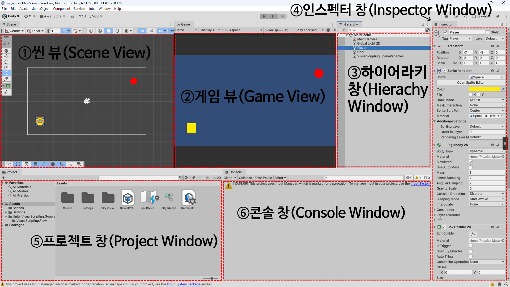

## 프로그래밍 언어 개요

### 1. 프로그래밍 언어의 역사와 발전 과정

프로그래밍 언어는 시대의 요구와 기술의 발전에 따라 끊임없이 변화해 왔습니다.

| 1970년대 이전 | 1970년대 | 1980년대 | 1990년대 | 2000년대 이후 |
| --- | --- | --- | --- | --- |
| Fortran | Pascal | ADA | Python | **C#** |
| Cobol | **C** | **C++** | HTML | Scala |
| Basic | Smalltalk | Object-C | Java | Go |
| BCPL | SQL | Perl | PHP | Swift |

### 2. 프로그래밍 언어의 분류

#### 1. 개발 편의성 측면에 따른 분류

* **저급 언어:** 기계어, 어셈블리어
* **고급 언어:** C, C++, C#, Python,  등 대다수 언어

#### 2. 실행 및 구현 방식에 따른 분류

* **명령형 언어:** 컴퓨터에 저장된 명령어들이 순차적으로 실행되는 프로그래밍 방식으로 상태를 강조하는 언어이다.
* **함수형 언어:** 함수의 응용을 강조하여 수학적인 수식 등의 함수들로 프로그램을 구성하여 호출하는 방식의 언어이다.
* **논리형 언어:** 논리적인 문장 구조를 이용하여 프로그램을 표현하고 계산을 수행하는 구조로 추론과 관계 규칙에 의해 원하는 결과를 얻는 언어이다.
* **객체지향형 언어:** 객체 간의 관계에 초점을 두고 기능을 중심으로 메소드를 구현하는 방법으로 상속, 캡슐화, 다형성, 추상화 등의 특징을 갖고 있다.

#### 3. 빌드(Build) 방식에 따른 언어 분류

작성한 소스코드가 컴퓨터에서 실행 가능한 형태로 변하는 과정을 빌드(Build)라고 하며, 이 방식에 따라 언어를 세 가지로 나눌 수 있습니다.

* **컴파일 언어 (Compile Language)**
* **특징:** 소스코드가 기계어 실행 파일로 통째로 빌드되는 방식입니다. 번역 속도는 걸리지만, 한 번 번역되면 **실행 속도가 매우 빠릅니다.**
* **종류:** C, C++, C#

* **인터프리터 언어 (Interpreter Language)**
* **특징:** 소스코드를 미리 번역하지 않고, 실행할 때 **한 줄씩 번역하며 실행**하는 방식입니다. **실시간 실행 및 결과 분석**에 유리합니다.
* **종류:** Python 등

* **바이트 코드 언어 (Byte Code Language)**
* **특징:** 컴파일을 통해 1차적으로 가상머신(Virtual Machine)이 이해할 수 있는 **Byte Code**로 변환한 뒤, 가상머신이 각 운영체제(Native OS)에 맞춰 다시 기계어로 번역해 실행하는 방식입니다.
* **종류:** JAVA, Scala 등

### 3. 개발 목적 및 분야별 프로그래밍 언어 분류

소프트웨어를 개발할 때는 개발하는 대상과 플랫폼에 따라 사용하는 언어가 완전히 상이합니다.

* **인공지능/데이터 분석:** Python, R
* **프런트엔드 (사용자 화면):** HTML, CSS, JavaScript
* **백엔드/웹 서비스:** JSP, PHP, ASP 등

* **모바일 개발 (Mobile)**
* **안드로이드(Android):** JAVA, Kotlin 등
* **iOS (아이폰):** Objective-C, Swift 등

* **데스크톱 (Desktop):** C, C++, C# 등
* **게임 (Game):** C, C++, Unity(C#) 등
* **AI / 빅데이터 분석:** Python, R 등

### 4. C# 언어와 유니티(Unity) 엔진의 관계

* **C# 언어의 정의:** C와 C++의 발전된 형태로 마이크로소프트의 **.NET 환경**에 맞춰 설계된 언어입니다. 사용자 인터페이스(UI)를 쉽게 만들 수 있는 **컴포넌트 기능**을 기본 제공합니다.
* **유니티(Unity) 엔진:** 단순한 언어가 아니라 그래픽 처리, 물리 연산, 사운드 등 게임 필수 시스템을 미리 갖춘 종합 게임 엔진(개발 환경)입니다. 유니티에서 게임의 규칙과 로직을 짜는 주력 스크립트 언어가 바로 C#입니다.
* **멀티 플랫폼(Multi-platform) 빌드의 이점:** 유니티 내에서 **하나의 C# 소스 코드**만 작성해 두면, 안드로이드(.apk), iOS, PC(.exe), 콘솔 등 다양한 기기용 파일로 한 번에 추출할 수 있습니다. 각 OS별 언어(Java, Swift 등)를 따로 배울 필요가 없어 시간과 비용이 절약됩니다.

## 유니티 화면 구성

* **1. 씬 뷰 (Scene View)**
* **특징:** 개발자가 게임 월드를 직접 보면서 캐릭터나 배경 등 **오브젝트를 배치, 이동, 회전, 크기 조절하는 작업 공간**입니다. 플레이어에게는 보이지 않는 개발자 전용 설계도 화면입니다.

* **2. 게임 뷰 (Game View)**
* **특징:** 게임이 실행되었을 때 **플레이어가 실제로 보게 될 최종 화면**을 미리 보여주는 창입니다. 씬에 배치된 '카메라(Camera)'가 비추는 화면을 그대로 출력하며, 상단의 Play(▶) 버튼을 누르면 실시간으로 게임을 테스트할 수 있습니다.

* **3. 하이어라키 창 (Hierarchy Window)**
* **특징:** 현재 열려 있는 씬에 **배치되어 있는 모든 게임 오브젝트들을 리스트 형태의 계층 구조(부모-자식 관계)로 나열**해 주는 창입니다. 이곳에 이름이 존재해야만 현재 게임 세상에 존재하는 오브젝트입니다.

* **4. 인스펙터 창 (Inspector Window)**
* **특징:** 하이어라키 창이나 프로젝트 창에서 **선택한 오브젝트의 상세 정보, 속성, 조립된 컴포넌트(Component)들을 보여주고 수정**할 수 있는 창입니다. 예를 들어, 오브젝트의 좌표나 색상을 바꿀 때 이곳을 이용합니다.

* **5. 프로젝트 창 (Project Window)**
* **특징:** 게임 제작에 필요한 모든 소스 파일(C# 스크립트, 이미지, 사운드, 3D 모델 등)이 보관되는 ‘에셋(Asset) 창고’입니다. 컴퓨터의 파일 탐색기(폴더)와 같은 역할을 합니다.

* **6. 콘솔 창 (Console Window)**
* **특징:** 프로그램 실행 중 발생하는 **로그(Log), 경고(Warning), 에러(Error) 메시지를 출력**해 주는 창입니다. 스크립트 코드의 오류를 찾아내거나(디버깅), 내가 원하는 값이 잘 나오는지 확인할 때 반드시 확인해야 하는 창입니다.