## 객체지향 프로그래밍 기초

### Git(깃)

Git은 리누즈 토발즈(Linus Torvalds)가 만든 버전 관리 시스템

**Git의 특징**
* 소스코드의 역사를 기록한다.
* 타임머신처럼 특정 시점의 소스코드 상태로 이동할 수 있다.
* 코드 백업, 복구, 협업을 혁신적으로 단순화해주는 필수 개발도구이다.

### Github(깃허브)

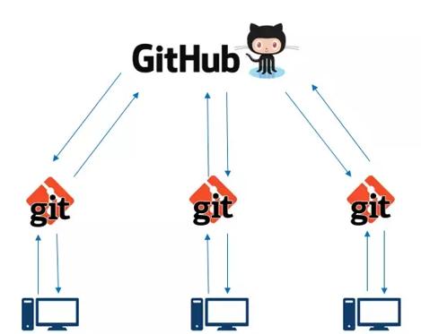

Github 는 개발자들이 코드를 저장하고, 공유하고, 다른 개발자들과 함께 프로그램을 만드는 코딩 전용 SNS 입니다.

Github 는 작성한 소스코드를 안전하게 인터넷에 보관할 수 있는 저장소(Repository)입니다.

### Codespaces: Github 에서 VS Code 사용하기

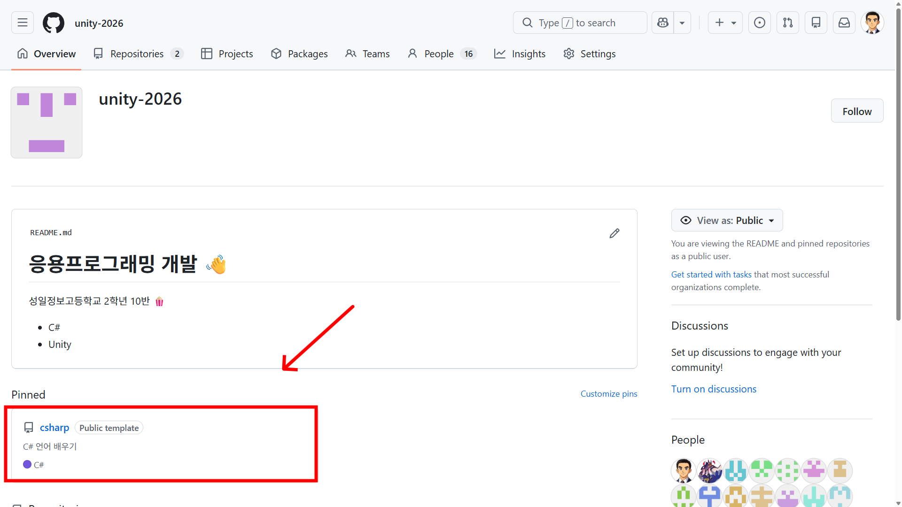

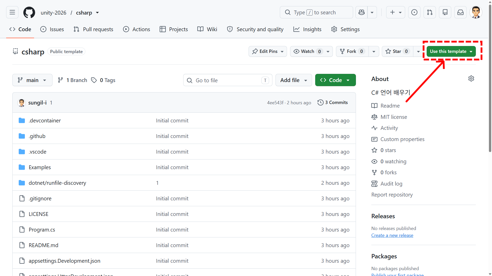

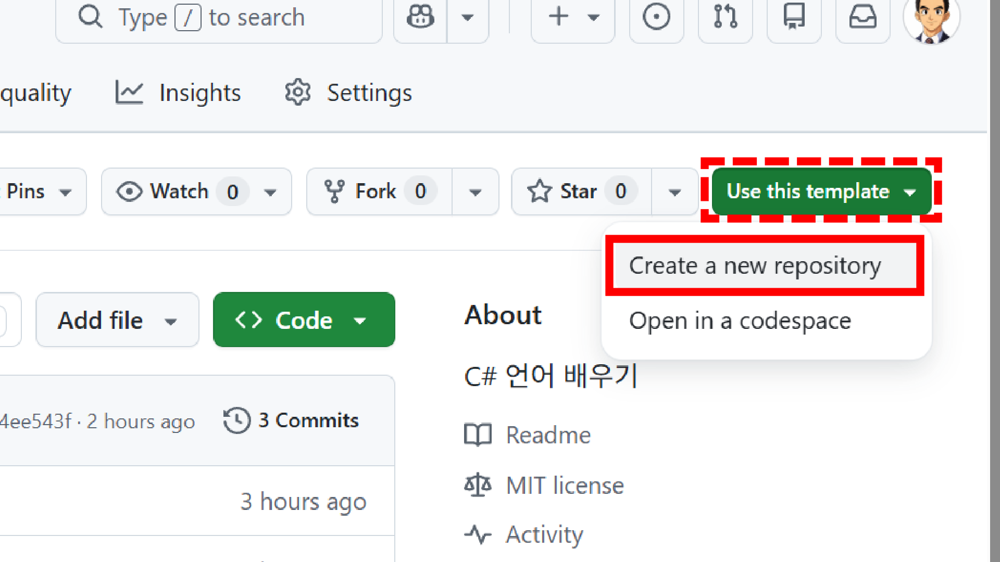

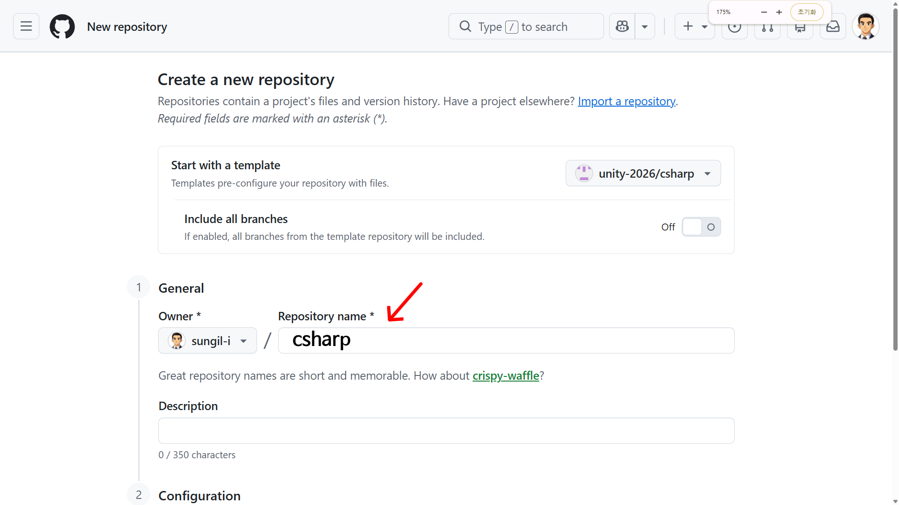

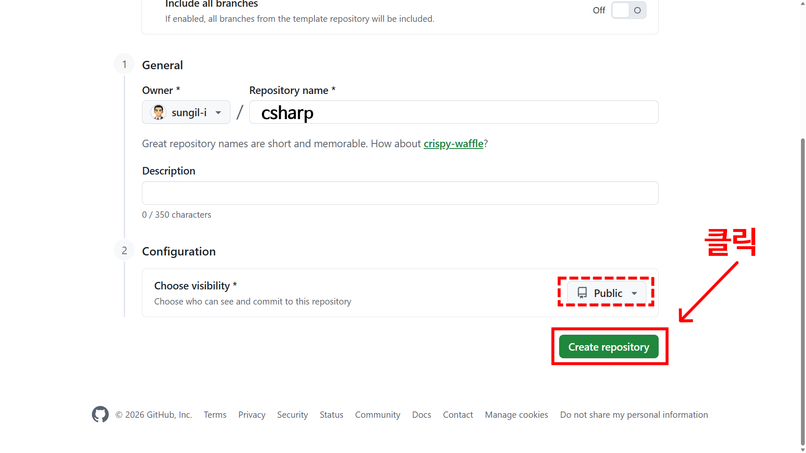

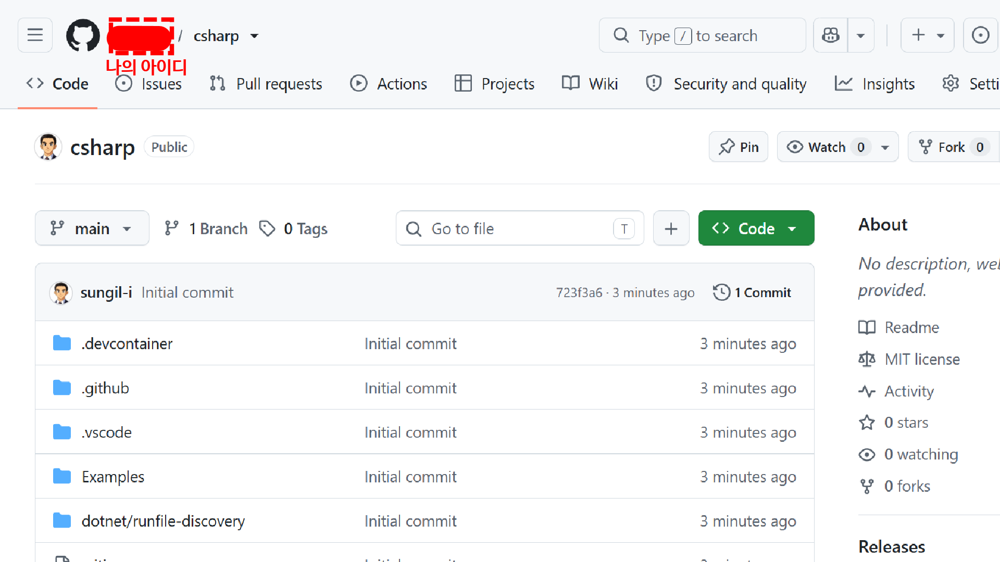

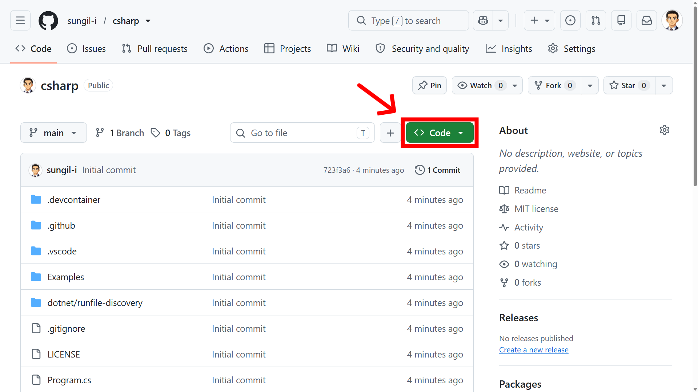

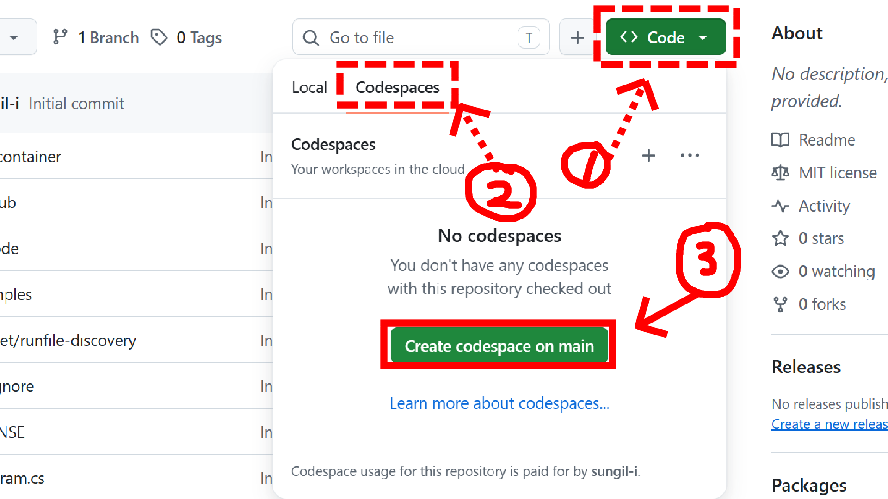

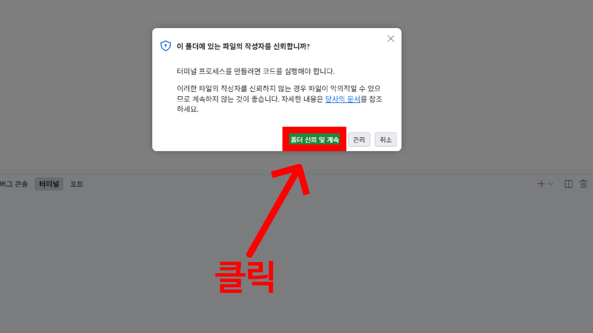

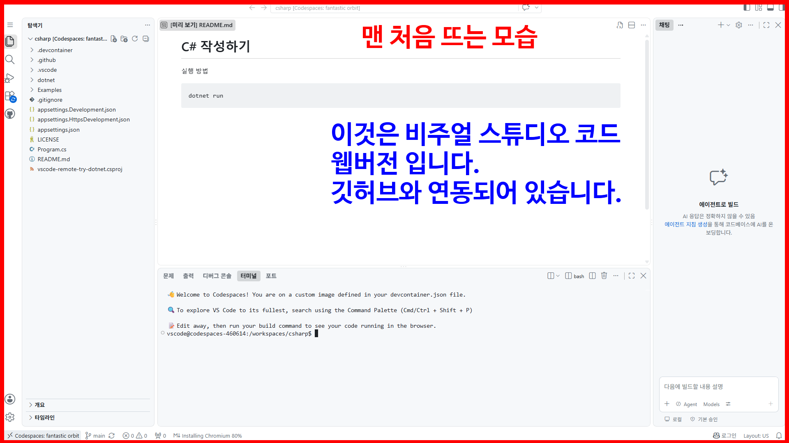

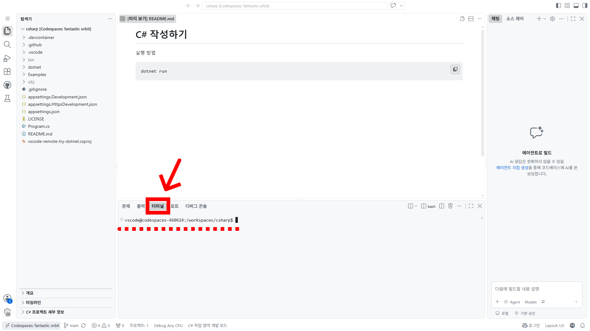

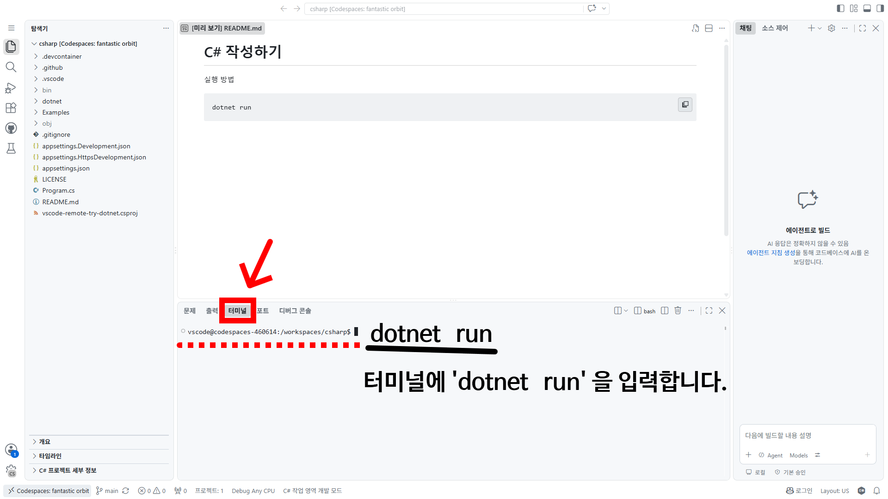

