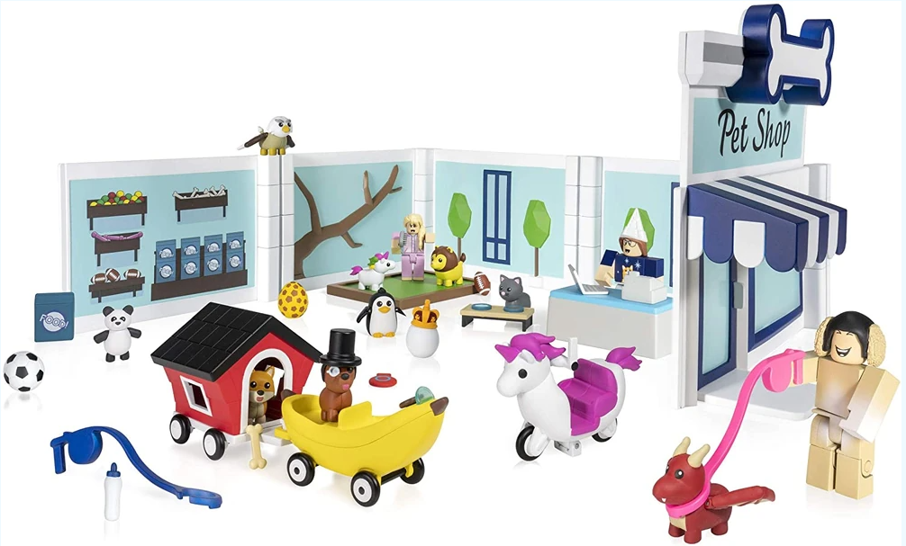
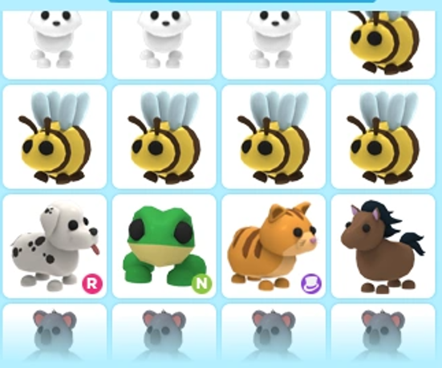

## 객체지향 상속

로블록스 Adopt me

### 객체지향 상속의 개념

**상속**: 부모 클래스의 멤버 변수와 멤버 함수를 자식 클래스에게 물려주는 것.

### C# 상속

로블록스 **Adopt me** 에서 `Pet` 이라는 부모 클래가 있다.

`Pet` 을 부모로 하는 자녀 클래스인 `Dog`, `Cat`, `Frog`, `Horse`, ... 을 만들 수 있다.

`:` (세미콜론)을 사용하여 부모 클래스(멤버 변수/멤버 함수)를 자식 클래스로 상속한다.

* `Pet` 클래스를 상속 받은 `Dog` 클래스를 만든다. → `public class Dog : Pet { }`
* `Pet` 클래스를 상속 받은 `Frog` 클래스를 만든다. → `public class Frog : Pet { }`

