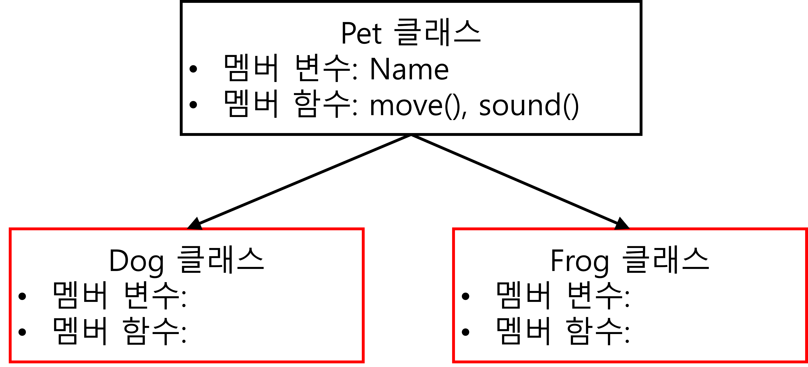

## 객체지향 상속 (이론)


로블록스 Adopt me

### 객체지향 상속의 개념

**상속**: 부모 클래스의 멤버 변수와 멤버 함수를 자식 클래스에게 물려주는 것.

### C# 상속

로블록스 **Adopt me** 에서 `Pet` 이라는 부모 클래가 있다.

`Pet` 을 부모로 하는 자녀 클래스인 `Dog`, `Cat`, `Frog`, `Horse`, ... 을 만들 수 있다.

`:` (세미콜론)을 사용하여 부모 클래스(멤버 변수/멤버 함수)를 자식 클래스로 상속한다.

* `Pet` 클래스를 상속 받은 `Dog` 클래스를 만든다.<br>→ `public class Dog : Pet { }`
* `Pet` 클래스를 상속 받은 `Frog` 클래스를 만든다.<br>→ `public class Frog : Pet { }`

## 객체지향 상속 (실습)



### Pet 클래스 설계하기

C# 소스코드

```csharp
using System;

namespace HelloWorld
{
    public class Pet
    {
        // 멤버 변수
        public string Name;
        // 멤버 함수
        public Pet() // 생성자 멤버함수
        {
            Console.WriteLine("객체 생성!");
        }
        public Pet(string name) // 생성자 멤버함수
        {
            this.Name = name;
            Console.WriteLine("객체 생성!");
            Console.WriteLine($"나의 이름은 {Name} 입니다.");
        }
        public void WhoAreYou()
        {
            Console.WriteLine($"나의 이름은 {Name} 입니다.");
        }
        public void Move()
        {
            Console.WriteLine($"{Name}이/가 움직입니다.");
        }
        public void Sound()
        {
            Console.WriteLine($"{Name}이/가 소리를 냅니다.");
        }
    }
}
```

### Dog 클래스 설계하기

C# 소스코드

```csharp
using System;

namespace HelloWorld
{
    public class Dog : Pet
    {
        // 부모 클래스의 생성자 멤버 함수를 가져온다.
        public Dog() : base() {}
        public Dog(string name) : base(name) {}
    }
}
```

### Dog 인스턴스 생성하기

C# 소스코드

```csharp
// Dog 객체 생성하기
Dog mydog = new Dog();
mydog.Name = "멍멍";
mydog.WhoAreYou();
mydog.Move();
mydog.Sound();
```

### Frog 클래스 설계하기

C# 소스코드

```csharp
using System;

namespace HelloWorld
{
    public class Frog : Pet
    {
        // 부모 클래스의 생성자 멤버 함수를 가져온다.
        public Frog() : base() {}
        public Frog(string name) : base() {}
    }
}
```

### Dog 인스턴스 생성하기

C# 소스코드

```csharp
// Frog 객체 생성하기
Frog myfrog = new Frog("개굴");
myfrog.Move();
myfrog.Sound();
```


