<!--

-->

## 프로젝트

### 생성

| 항목 | 값 |
| :-: | :-: |
| 에디터 버전 | 6.3 LTS |
| 타입 | Universal 3D |
| 프로젝트 이름 | 3d-starter |

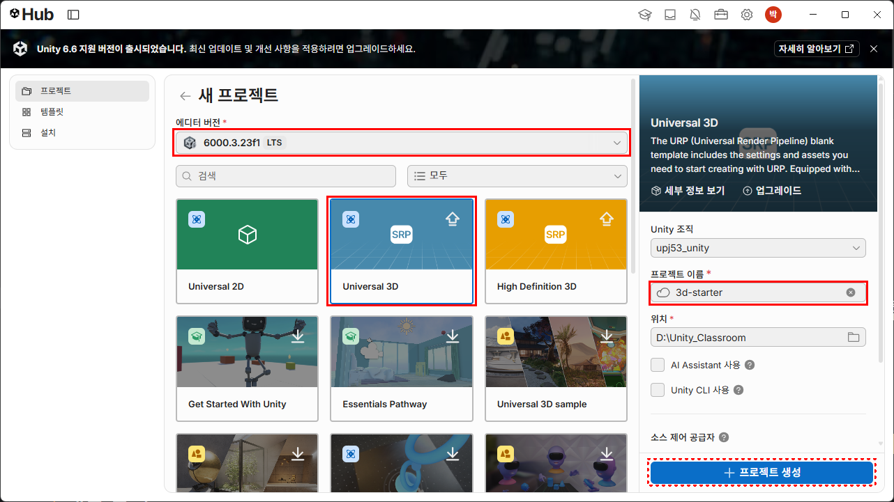

### VS Code 에디터로 설정

* 메뉴: Edit → Preferences ▶ External Tool → External Script Editor : Visual Studio Code

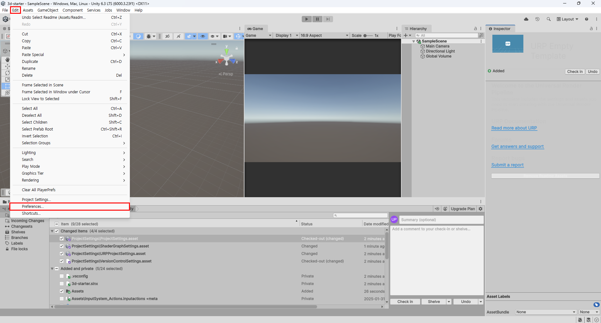

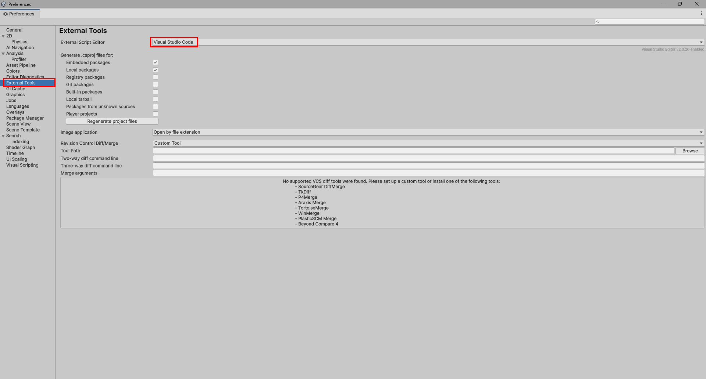

### 키보드 입력 추가

* 메뉴: Edit → Project Settings ▶ Player → Other Settings → Active Input Handling : Both

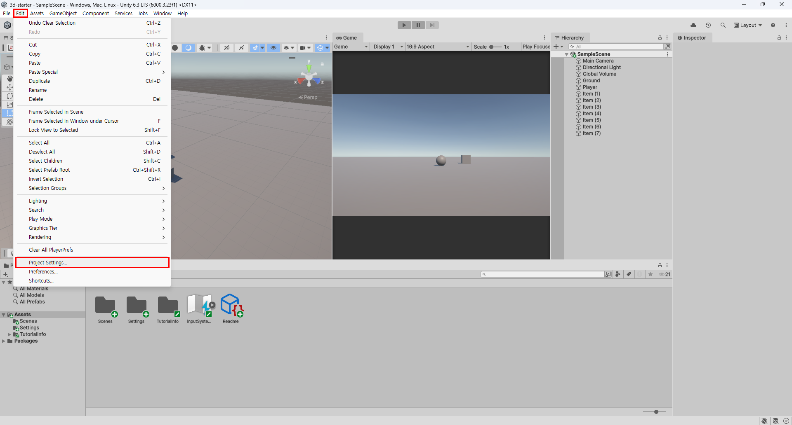

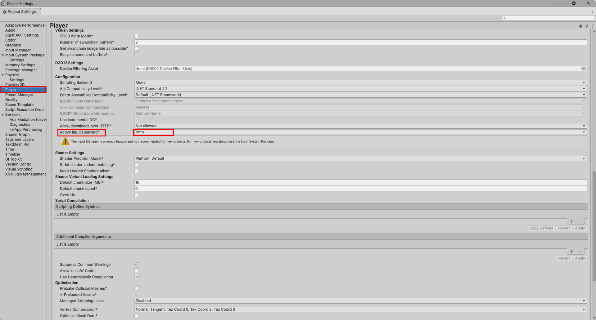

## 게임 오브젝트 만들기

### Ground 만들기

* Hierachy 에서 마우스 우클릭 ▶ 3D Object → Plane
* 이름을 Ground 로 변경한다.
* 크기 변경: Scale `X=10`, `Y=10`, `Z=10`

### Player 만들기

* Hierachy 에서 마우스 우클릭 ▶ 3D Object → Sphere
* 이름을 Player 로 변경한다.
* Tag 를 Player 로 선택한다.
* 위치 변경: Position `X=0`, `Y=0.5`, `Z=0`

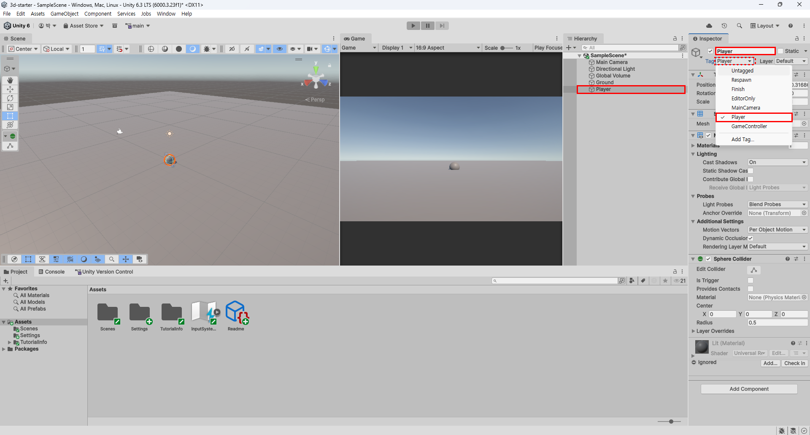

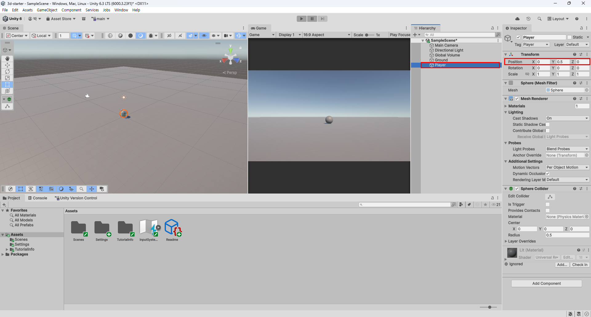

### Item 만들기

* Hierachy 에서 마우스 우클릭 ▶ 3D Object → Cube
* 이름을 Item (1) 로 변경한다.
* 새로운 Tag 추가: Tag 의 Add Tag... 를 선택한다.
    * `+` 를 누르고 New Tag Name 에 Item 을 입력한 뒤 `Save` 한다.
    * 그리고 다시 Item (1) 객체의 Tag 를 누르고 'Item' 을 선택한다.
* 위치 변경: Position `X=3`, `Y=0.5`, `Z=3`

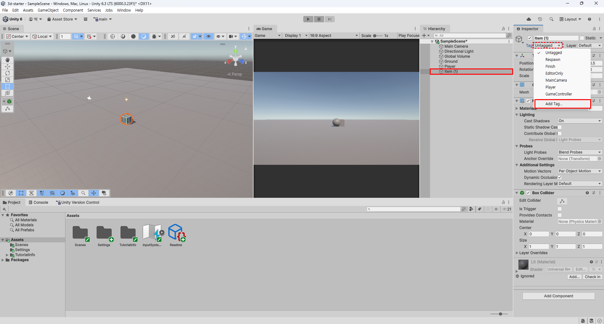

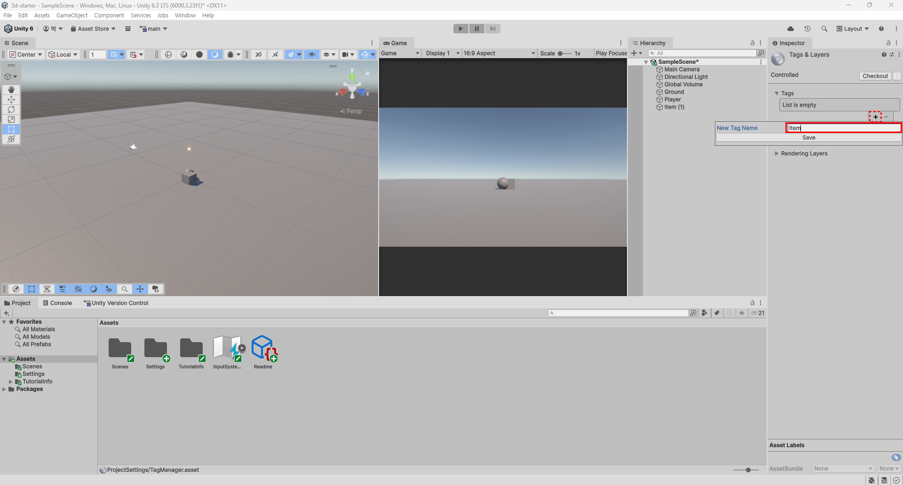

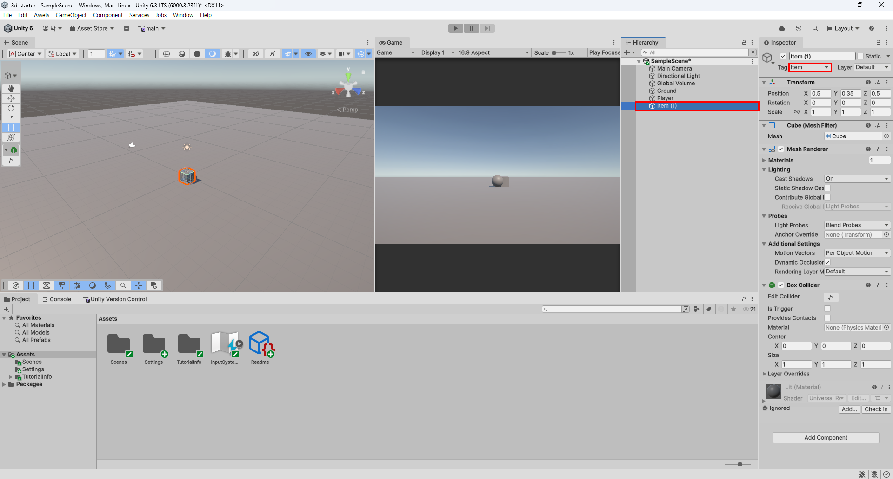

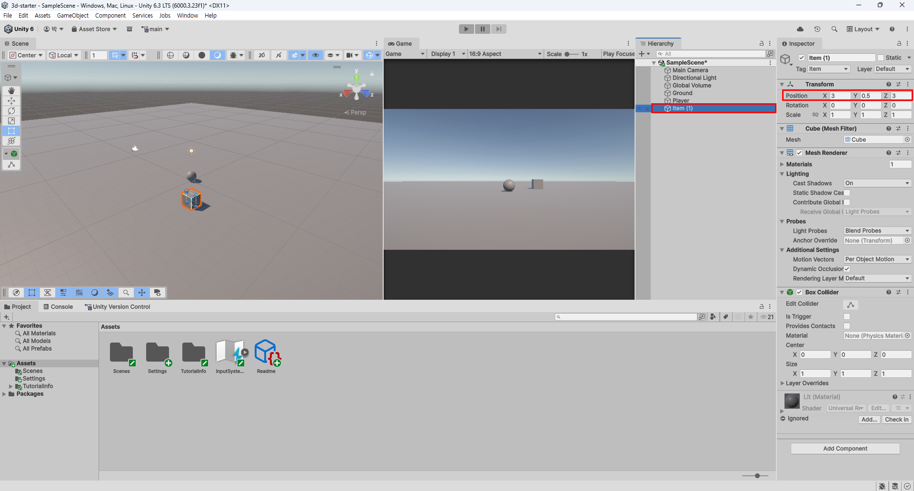

* Item (1) 객체 복사: Hierachy 에서 Item (1) 를 누르고 `Ctrl + D` 를 6번 누른다.
* Item (1) ~ Item (7) 까지 만든다.
* Item (2) 부터 Item (7) 까지 위치를 변경한다.
    * Item (2): Position `X=-7`, `Y=0.5`, `X=7`
    * Item (3): Position `X=5`, `Y=0.5`, `X=1`
    * Item (4): Position `X=-5`, `Y=0.5`, `X=-7`
    * Item (5): Position `X=5`, `Y=0.5`, `X=-4`
    * Item (6): Position `X=4`, `Y=0.5`, `X=-9`
    * Item (7): Position `X=-9`, `Y=0.5`, `X=9`

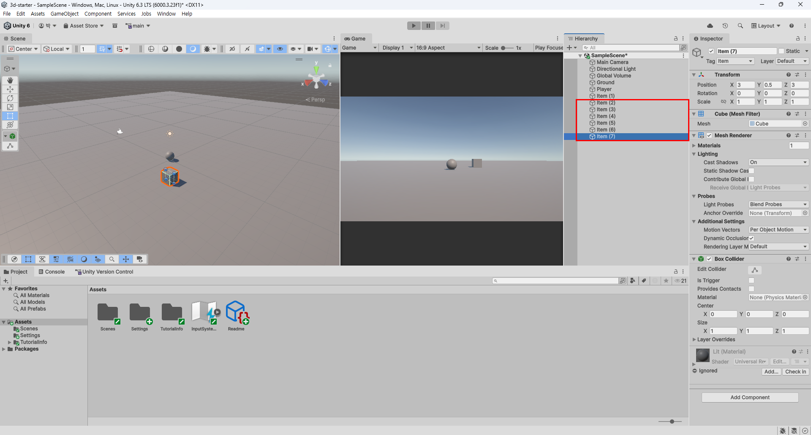

* Item (1) 부터 Item (7) 까지 재질을 변경한다.
* Item (1) 부터 Item (7) 까지 `Shift` 키로 복수 선택한다.
* Matarials 를 선택하고 Element 0 을 Gold 로 선택한다.

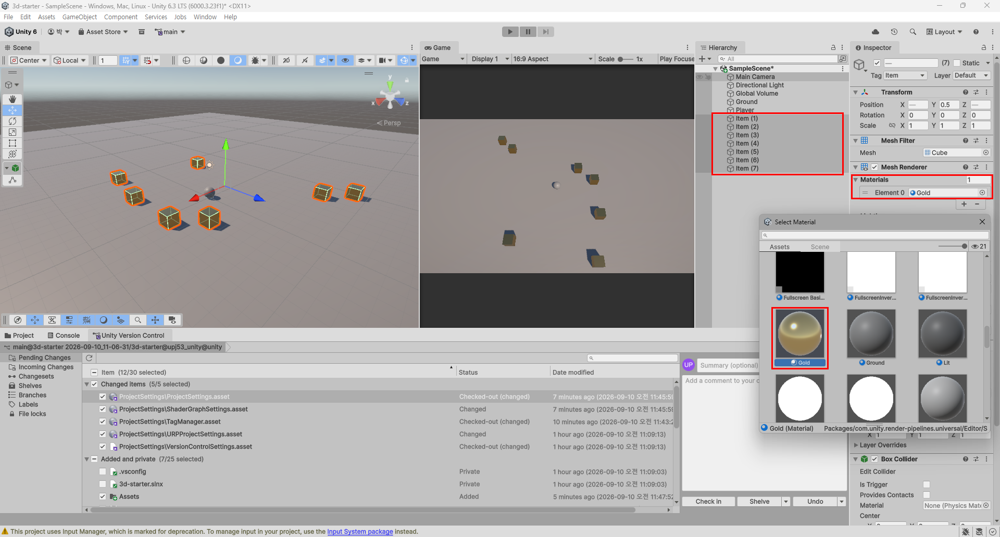

### Main Camera 조정

* 전체 화면이 보이도록 위치와 각도를 조정한다.
* 위치 조정: Position `X=0`, `Y=15`, `Z=-10`
* 각도 조정: Rotation `X=60`, `Y=0`, `Z=0`

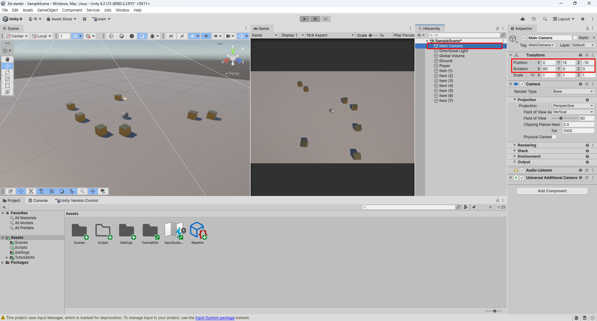

## C# 스크립트 작성

