<!--

-->

## 프로젝트

### 생성

| 항목 | 값 |
| :-: | :-: |
| 에디터 버전 | 6.3 LTS |
| 타입 | Universal 3D |
| 프로젝트 이름 | 3d-starter |

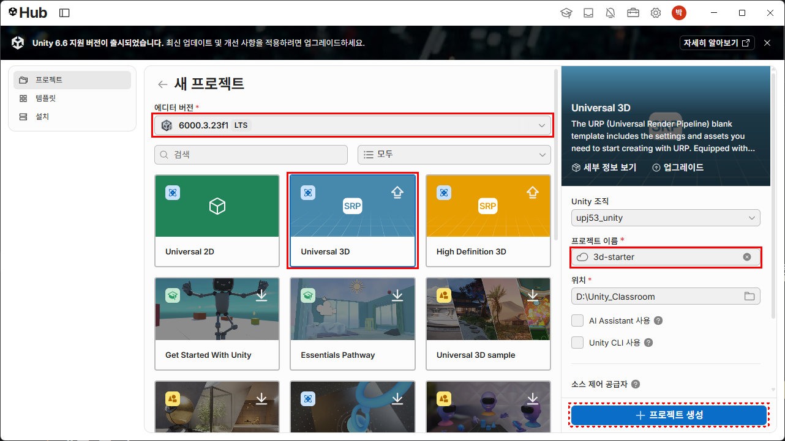

### VS Code 에디터로 설정

* 메뉴: Edit → Preferences ▶ External Tool → External Script Editor : Visual Studio Code

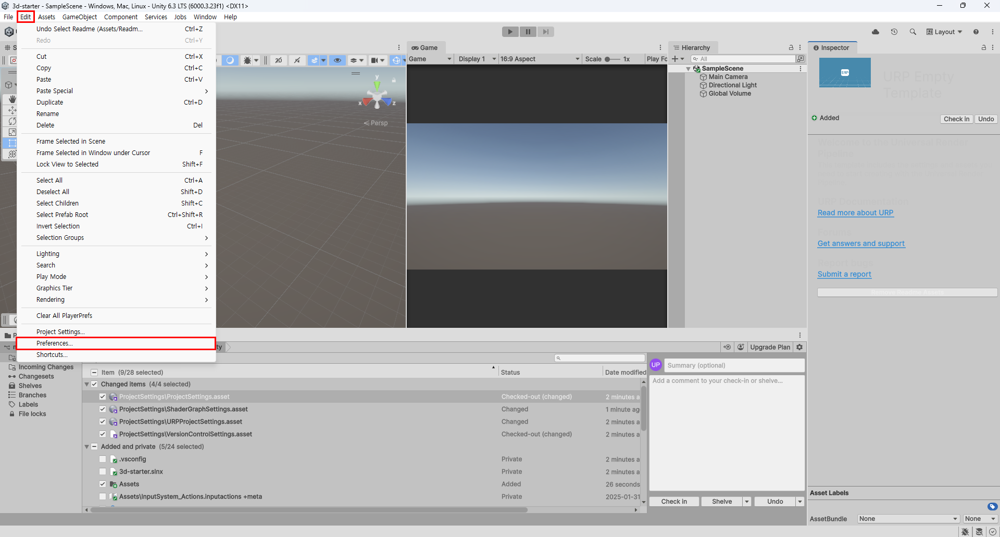

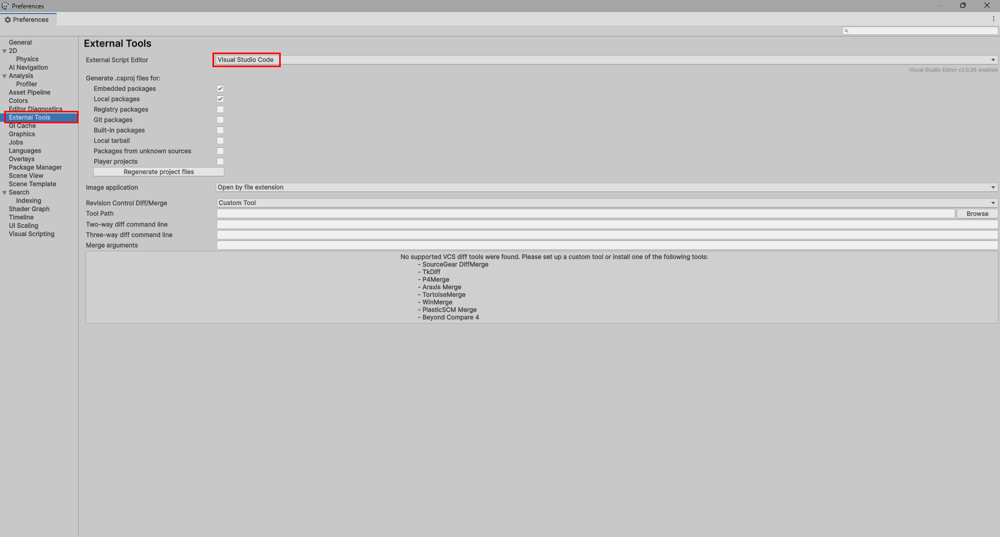


### 키보드 입력 추가

* 메뉴: Edit → Project Settings ▶ Player → Other Settings → Active Input Handling : Both

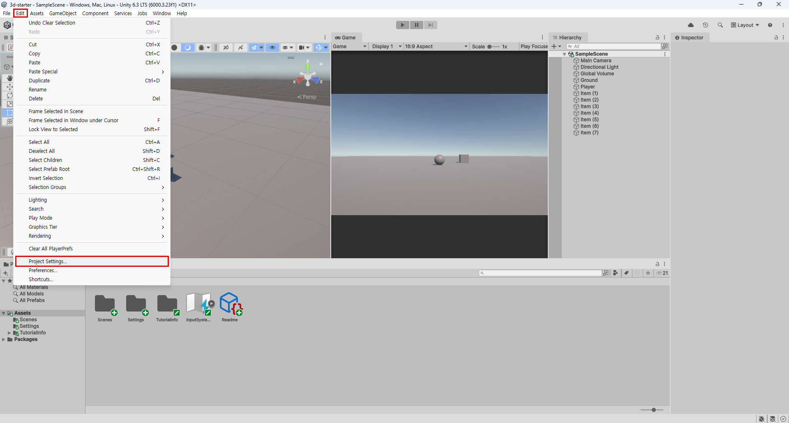

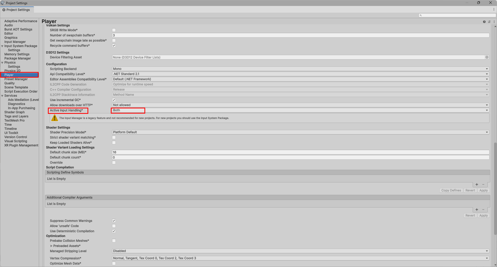

## 게임 오브젝트 만들기

### Ground 만들기

* Hierachy 에서 마우스 우클릭 ▶ 3D Object → Plane
* 이름을 Ground 로 변경한다.
* 크기 변경: Scale `X=10`, `Y=10`, `Z=10`


### Player 만들기

* Hierachy 에서 마우스 우클릭 ▶ 3D Object → Sphere
* 이름을 Player 로 변경한다.
* Tag 를 Player 로 선택한다.
* 위치 변경: Position `X=0`, `Y=0.5`, `Z=0`

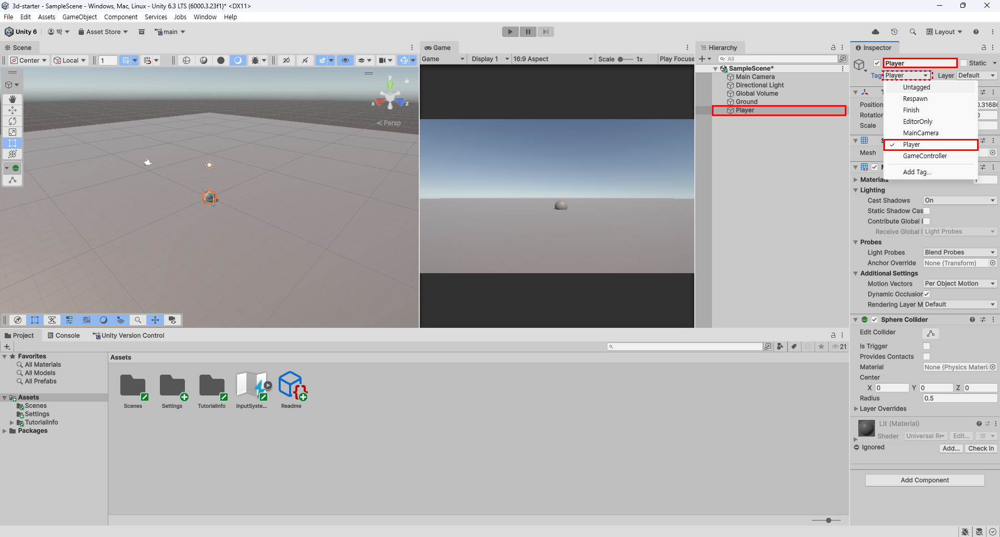

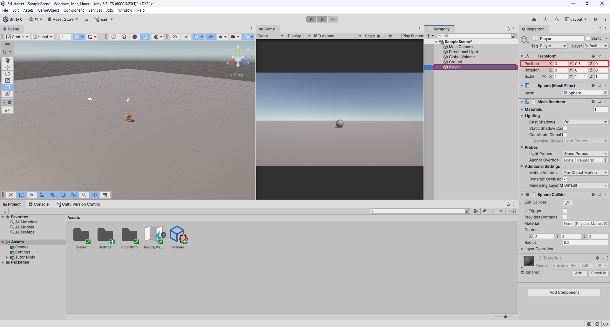

### Item 만들기

* Hierachy 에서 마우스 우클릭 ▶ 3D Object → Cube
* 이름을 Item (1) 로 변경한다.
* 새로운 Tag 추가: Tag 의 Add Tag... 를 선택한다.
    * `+` 를 누르고 New Tag Name 에 Item 을 입력한 뒤 `Save` 한다.
    * 그리고 다시 Item (1) 객체의 Tag 를 누르고 'Item' 을 선택한다.
* 위치 변경: Position `X=3`, `Y=0.5`, `Z=3`

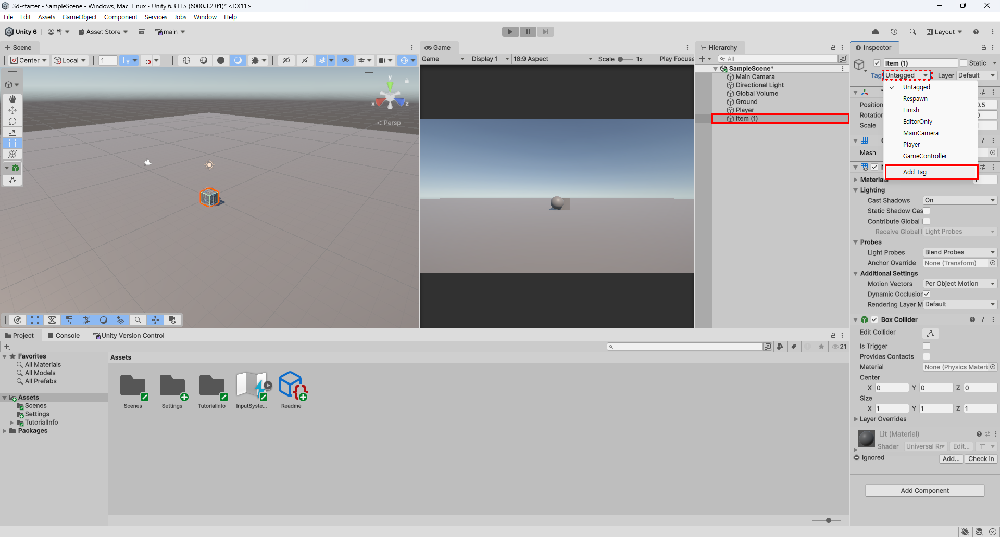

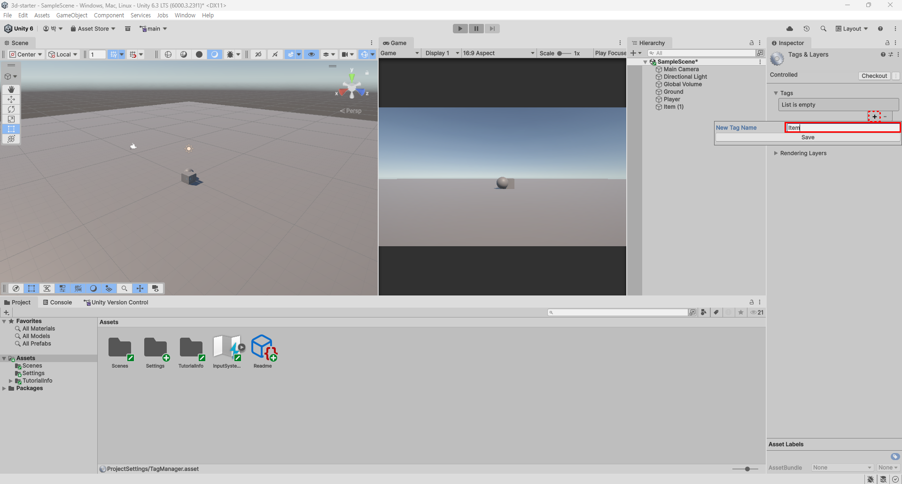

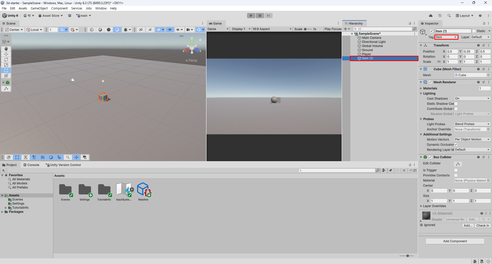

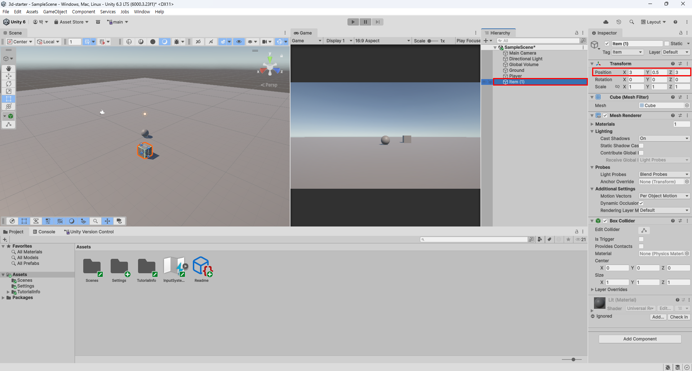

* Item (1) 객체 복사: Hierachy 에서 Item (1) 를 누르고 `Ctrl + D` 를 6번 누른다.
* Item (1) ~ Item (7) 까지 만든다.
* Item (2) 부터 Item (7) 까지 위치를 변경한다.
    * Item (2): Position `X=-7`, `Y=0.5`, `X=7`
    * Item (3): Position `X=5`, `Y=0.5`, `X=1`
    * Item (4): Position `X=-5`, `Y=0.5`, `X=-7`
    * Item (5): Position `X=5`, `Y=0.5`, `X=-4`
    * Item (6): Position `X=4`, `Y=0.5`, `X=-9`
    * Item (7): Position `X=-9`, `Y=0.5`, `X=9`

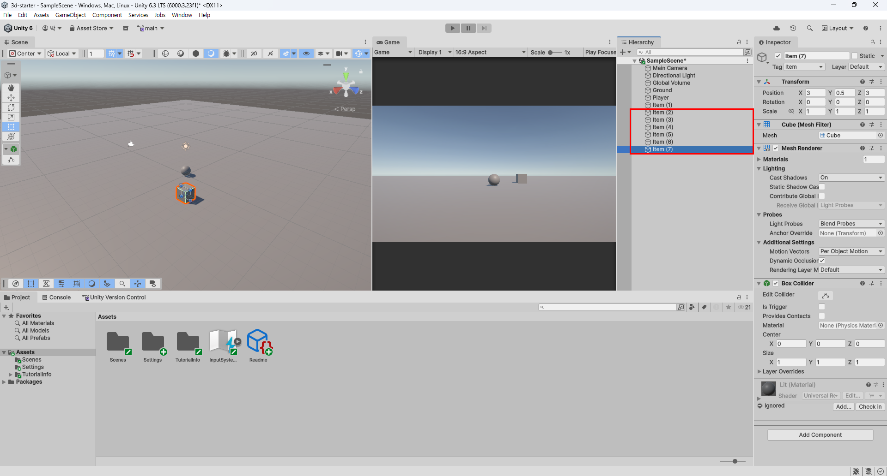

* Item (1) 부터 Item (7) 까지 재질을 변경한다.
* Item (1) 부터 Item (7) 까지 `Shift` 키로 복수 선택한다.
* Matarials 를 선택하고 Element 0 을 Gold 로 선택한다.

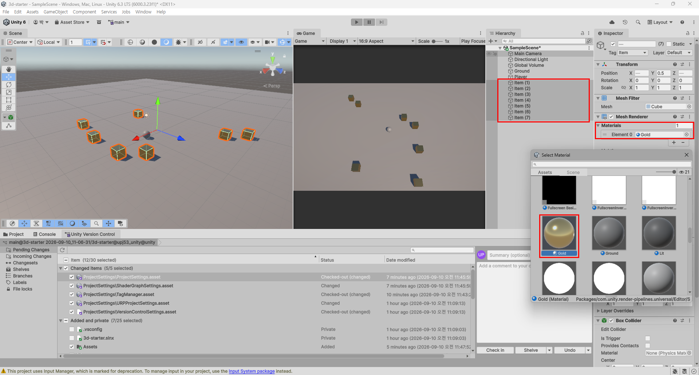

### Main Camera 조정

* 전체 화면이 보이도록 위치와 각도를 조정한다.
* 위치 조정: Position `X=0`, `Y=15`, `Z=-10`
* 각도 조정: Rotation `X=60`, `Y=0`, `Z=0`

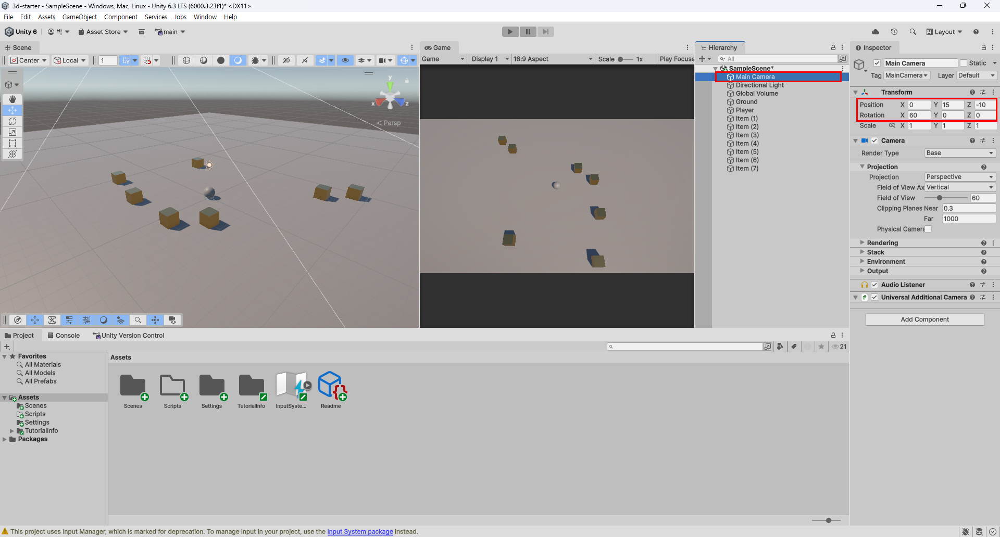

## C# 스크립트 작성

### `PlayerController.cs` 소스코드

3D 공 굴리기 플레이어 클래스(Class): 게임 속 플레이어 공의 설계도

```csharp
using UnityEngine;

public class PlayerController : MonoBehaviour
{
    // =========================================================================
    // [1. 멤버 변수 (Member Variables / Fields) - 객체의 '상태'나 '데이터'를 저장]
    // =========================================================================

    [Header("1. 이동 관련 데이터 (멤버 변수)")]
    // [SerializeField]는 private 변수를 보호(캡슐화)하면서도 유니티 인스펙터 창에서 편집할 수 있게 해줍니다.
    [SerializeField] private float moveForce = 8.0f; // 공을 밀어주는 힘의 세기

    [Header("2. 컴포넌트 참조 데이터 (멤버 변수)")]
    // 다른 인스턴스(물리 부품)를 가리킬 참조 변수입니다. 처음에는 비어 있습니다(null).
    private Rigidbody rb;

    [Header("3. 게임 상태 데이터 (멤버 변수)")]
    // 학생이 키보드를 눌렀을 때 입력된 방향값을 기억해 둘 변수입니다.
    private float moveX;
    private float moveZ;

    // 수집한 아이템의 개수를 저장하는 정수형 멤버 변수입니다.
    private int collectedCount = 0;


    // =========================================================================
    // [2. 멤버 함수 (Member Methods) - 객체의 '행동'이나 '기능'을 구현]
    // =========================================================================

    // Start(): 게임이 시작될 때 엔진에 의해 딱 한 번 자동으로 호출되는 초기화 함수
    void Start()
    {
        // 내 게임오브젝트에 부착된 Rigidbody(물리 부품) 인스턴스를 찾아서 rb 멤버 변수에 저장합니다.
        // 이것을 객체지향에서는 "참조(Reference)를 연결한다"고 부릅니다.
        rb = GetComponent<Rigidbody>();

        // 방어적 확인: 만약 Rigidbody 부품을 깜빡하고 안 붙였다면 경고를 출력합니다.
        if (rb == null)
        {
            Debug.LogError("[오류] 플레이어 오브젝트에 Rigidbody 컴포넌트가 없습니다! Inspector에서 추가해 주세요.");
        }
    }

    // Update(): 화면이 새로고침될 때마다(매 프레임) 계속 호출되는 함수 (입력 감지에 적합)
    void Update()
    {
        // 키보드 입력을 읽어서 멤버 변수에 저장합니다.
        // A/D 또는 좌우 화살표: -1.0 ~ +1.0
        moveX = Input.GetAxis("Horizontal");

        // W/S 또는 상하 화살표: -1.0 ~ +1.0
        moveZ = Input.GetAxis("Vertical");
    }

    // FixedUpdate(): 물리 엔진의 고정 주기(초당 50회)마다 호출되는 물리 연산 전용 함수
    void FixedUpdate()
    {
        // Rigidbody 부품이 정상적으로 연결되어 있을 때만 물리 힘을 가합니다.
        if (rb != null)
        {
            // 3차원 공간에서 움직일 방향(X: 좌우, Y: 높이 0, Z: 앞뒤)을 만듭니다.
            Vector3 movement = new Vector3(moveX, 0.0f, moveZ);

            // 물리 부품(Rigidbody)의 멤버 함수인 AddForce()를 호출하여 공을 밉니다.
            rb.AddForce(movement * moveForce);
        }
    }

    // OnTriggerEnter(): 다른 물체의 영역(Trigger Collider)에 들어갔을 때 엔진이 호출해 주는 함수
    void OnTriggerEnter(Collider collider)
    {
        // 부딪힌 상대방 오브젝트의 태그(Tag)가 "item"인지 확인합니다.
        if (collider.CompareTag("item"))
        {
            // 1) 수집 개수 1 증가 (멤버 변수 데이터 변경)
            collectedCount++;

            // 2) 콘솔 창에 현재 상태 출력
            Debug.Log($"[아이템 획득] 현재 아이템 수: {collectedCount}");

            // 3) 먹은 아이템 오브젝트를 화면에서 제거
            Destroy(collider.gameObject);
        }
    }
}
```

### `RotateAnimator.cs` 소스코드

3D 오브젝트를 지정한 속도로 지속 회전시키는 애니메이션 스크립트

```csharp
using UnityEngine;

public class RotateAnimator : MonoBehaviour
{
    [Header("회전 속도 설정")]
    [Tooltip("초당 각 축(X, Y, Z)으로 회전할 각도 속도(도/초)입니다.")]
    // [SerializeField]는 private 필드의 정보 은닉(캡슐화)을 유지하면서도
    // 유니티 인스펙터(Inspector) 창에서 값을 직접 수정할 수 있게 해줍니다.
    [SerializeField] private Vector3 rotateSpeed = new Vector3(15f, 30f, 45f);

    // 유니티 생명주기: 모니터 화면이 새로고침될 때마다(매 프레임) 반복 실행되는 함수
    private void Update()
    {
        // [프레임 독립성 (Time.deltaTime)]
        // 1. 컴퓨터 사양에 따라 초당 프레임 수(FPS)는 30FPS, 60FPS, 144FPS 등으로 다릅니다.
        // 2. 만약 Time.deltaTime(이전 프레임에서 현재 프레임까지 걸린 시간, 약 0.016초)을 곱하지 않으면
        //    성능이 좋은 고주사율 PC에서 큐브가 훨씬 더 빠르게 도는 치명적인 버그가 발생합니다.
        // 3. (속도 * Time.deltaTime)을 적용하면 어떤 환경에서도 1초에 정확히 지정한 각도만큼 균일하게 회전합니다.
        transform.Rotate(rotateSpeed * Time.deltaTime);
    }
}
```

### `CameraController.cs` 소스코드

플레이어를 따라다니는 기본 3D 카메라 추적 스크립트

```csharp
using UnityEngine;

public class CameraController : MonoBehaviour
{
    [Header("추적 대상 설정")]
    [Tooltip("카메라가 따라다닐 타겟(Player 공) 오브젝트입니다.")]
    // [SerializeField]는 변수를 private(캡슐화)로 보호하면서도 
    // 유니티 인스펙터 창에서 마우스 드래그로 연결할 수 있게 해주는 속성(Attribute)입니다.
    [SerializeField] private GameObject player;

    // 카메라와 플레이어 사이의 고정된 상대적 거리(간격)를 저장할 멤버 변수
    // 외부 클래스에서 변경할 필요가 없으므로 private으로 은닉합니다.
    private Vector3 offset;

    // 게임 시작 시 1회 호출되는 초기화 함수
    private void Start()
    {
        // 1. 방어적 Null 검사: 인스펙터에 플레이어가 정상 연결되었는지 확인합니다.
        if (player != null)
        {
            // [상대 거리 계산 원리: 벡터의 뺄셈]
            // (카메라 현재 위치) - (플레이어 현재 위치) = 두 물체 사이의 거리와 방향 벡터
            // 게임 내내 이 간격을 유지하면 카메라가 플레이어와 일정한 거리를 두고 따라갑니다.
            offset = transform.position - player.transform.position;
        }
        else
        {
            // 인스펙터 연결을 빠뜨렸을 때 학생이 바로 원인을 파악할 수 있도록 콘솔에 안내합니다.
            Debug.LogError("Player 오브젝트가 인스펙터에 할당되지 않았습니다.");
        }
    }

    // [Update vs LateUpdate]
    // 1. Update(): 매 프레임마다 키 입력이나 일반 로직을 처리하는 주기입니다.
    //    내용이 없는 빈 Update()는 엔진 내부 호출 비용을 유발하므로 실습 후 지우는 습관이 좋습니다.
    // 2. LateUpdate(): 씬에 존재하는 모든 Update()와 FixedUpdate()(물리 이동) 연산이 
    //    완전히 끝난 직후 마지막에 호출되는 유니티 전용 생명주기 함수입니다.
    private void LateUpdate()
    {
        // 2. 플레이어가 존재하는지 매 프레임 확인 후 위치 갱신
        if (player != null)
        {
            // [카메라 위치 동기화]
            // 물리 힘(AddForce)으로 먼저 이동을 마친 플레이어의 새 위치에 
            // 시작할 때 구해둔 상대 거리(offset)를 더해 카메라의 새 좌표를 결정합니다.
            // 만약 일반 Update()에서 이동시키면 플레이어 이동과 순서가 꼬여 화면 떨림(Jitter)이 발생합니다.
            transform.position = player.transform.position + offset;
        }
    }
}
```