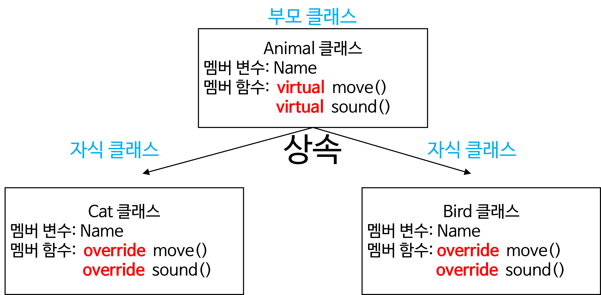

<!--

-->

## 객체지향 상속 (이론)


로블록스 Adopt me

### 객체지향 상속 (Override) 개념

**상속**: 부모 클래스의 멤버 변수와 멤버 함수를 자식 클래스에 물려주는 것

부모에게 물려받은 멤버 함수를 자녀 클래스에서 수정할 수 있다.

* `virtual`: 부모 클래스에서 수정 허용 권한을 주는 키워드이다.
* `override`: 자녀 클래스에서 부모 클래스의 멤버 함수를 수정하겠다는 표시를 하는 키워드이다.

## 객체지향 상속 (실습)

### 전체 클래스 설계

`Animal` 부모 클래스를 만들고, 이 클래스를 상속 받는 2개의 클래스를 만듭니다.

`Cat` 클래스와 `Bird` 클래스는 `Animal` 클래스를 부모로 갖는 자식 클래스입니다.



부모 클래스의 `move()` 함수와 `sound()` 함수가 있지만,

이것을 자식 클래스에서 그대로 사용하지 않고, 

수정해서 자신만의 기능을 구현해서 사용할 수 있다.

### `Animal` 클래스 설계 (부모 클래스)

`Animal` 클래스 C# 소스코드

```csharp
using System;

namespace HelloWorld
{
    public class Animal
    {
        // 멤버 변수
        public string Name;
        // 멤버 함수
        // 생성자 함수
        public Animal(string name)
        {
            this.Name = name;
            Console.WriteLine($"{Name} 인스턴스를 생성했습니다.");
        }
        // virtual 키워드는 부모 클래스에서 자식 클래스에게 수정 권한을 부여하는 것이다.
        public virtual void move() 
        {
            Console.WriteLine("움직인다..");
        }
        public virtual void sound()
        {
            Console.WriteLine("소리를 낸다!");
        }
    }
}
```

### `Cat` 클래스 설계 (자식 클래스 1)

`Cat` 클래스 C# 소스코드

```csharp
using System;

namespace HelloWorld
{
    public class Cat : Animal
    {
        // 생성자 함수 (자식 클래스 name → 부모 클래스 name)
        publc Cat(string name) : base(name) {}
        // 부모 클래스에 있는 move() 함수를 수정한다.
        public override void move() {
            Console.WriteLine("네발로 걸어간다..");
        }
        // 부모 클래스에 있는 sound() 함수를 수정한다.
        public override void sound() {
            Console.WriteLine("야옹!!");
        }
    }
}
```

### `Bird` 클래스 설계 (자식 클래스 2)

`Bird` 클래스 C# 소스코드

```csharp
using System;

namespace HelloWorld
{
    public class Bird : Animal
    {
        // 생성자 함수 (자식 클래스 name → 부모 클래스 name)
        publc Bird(string name) : base(name) {}
        // 부모 클래스에 있는 move() 함수를 수정한다.
        public override void move() {
            Console.WriteLine("훨훨 날아서 간다..");
        }
        // 부모 클래스에 있는 sound() 함수를 수정한다.
        public override void sound() {
            Console.WriteLine("짹짹!!");
        }
    }
}
```

### 인스턴스 생성

#### `Cat` 인스턴스 생성

`Cat` 인스턴스 생성 C# 소스코드

```csharp
Cat mycat = new Cat("헬로키티");
mycat.move();
mycat.sound();
```

실행결과

```text
헬로키티 인스턴스를 생성했습니다.
네발로 걸어간다..
야옹!!
```

#### `Bird` 인스턴스 생성

`Bird` 인스턴스 생성 C# 소스코드

```csharp
Bird mybird = new Bird("앵그리버드")
mybird.move();
mybird.sound();
```

실행결과

```text
앵그리버드 인스턴스를 생성했습니다.
훨훨 날아서 간다..
짹짹!!
```


