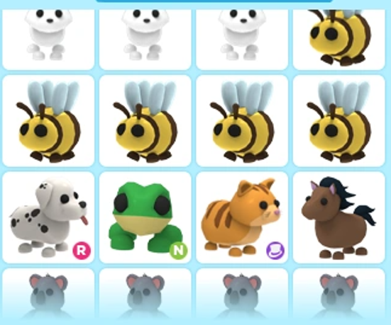

<!--

-->

## 객체지향 상속 (이론)

로블록스 Adopt me

### 객체지향 상속 (Override) 개념

**상속**: 부모 클래스의 멤버 변수와 멤버 함수를 자식 클래스에 물려주는 것

부모에게 물려받은 멤버 함수를 자녀 클래스에서 수정할 수 있다.

* `virtual`: 부모 클래스에서 수정 허용 권한을 주는 키워드이다.
* `override`: 자녀 클래스에서 부모 클래스의 멤버 함수를 수정하겠다는 표시를 하는 키워드이다.

