<!--

-->

## Unity 슈팅게임 1

### 학습주제 

1. 이미지(Sprite)를 사용해서 객체(Object)를 만들 수 있다.
    * 이미지를 Assets 에 Sprites 로 등록한다.
    * 1개의 이미지를 여러개의 객체로 나눈다.
    * 이미지를 객체로 등록한다.
    * 이미지에 충돌 감지 기능(Collider)을 부착한다.
2. 슈팅 부모클래스를 만들어서 아군과 적군 클래스를 자식클래스로 만들 수 있다.
    * 슈팅 부모클래스를 만든다. (기본적인 슈팅 기능이 장착되어 있다.)
    * 부모클래스를 상속 받는 자식클래스 2개를 만든다.(아군, 적군)
    * 총알 클래스를 만들어서 '스페이스바'를 누르면 총알을 발사한다.

### 프로젝트 요약

| 항목 | 값 |
| :-: | :-: |
| 에디터 버전 | 6.3 LTS |
| 타입 | Universal 2D |
| 프로젝트 이름 | shooting-1 |

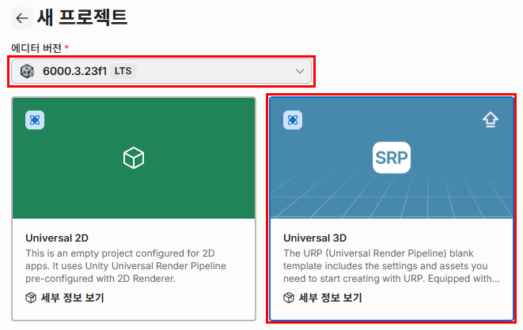

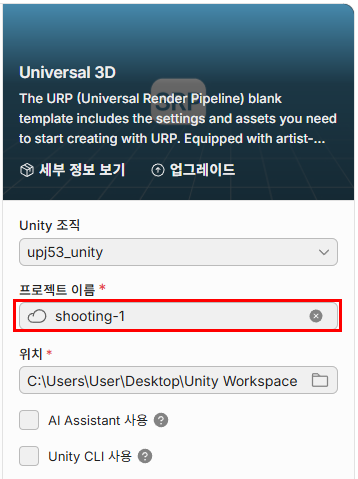

### 프로젝트 기본 세팅

#### 입력방식 'both' 추가

메뉴에서 `Edit → Project Settings → Player → Other Setting → Active Input Handling` 을 찾아서

Active Input Handling 를 `Both` 로 선택한다.

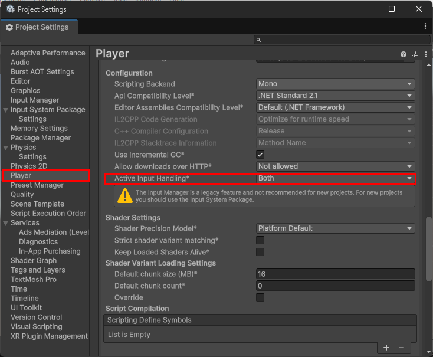

#### VS Code 설정

메뉴에서 `Edit → Preferences → External Tools → External Script Editor` 을 찾아서

External Script Editor 를 `Visual Studio Code` 로 선택한다.

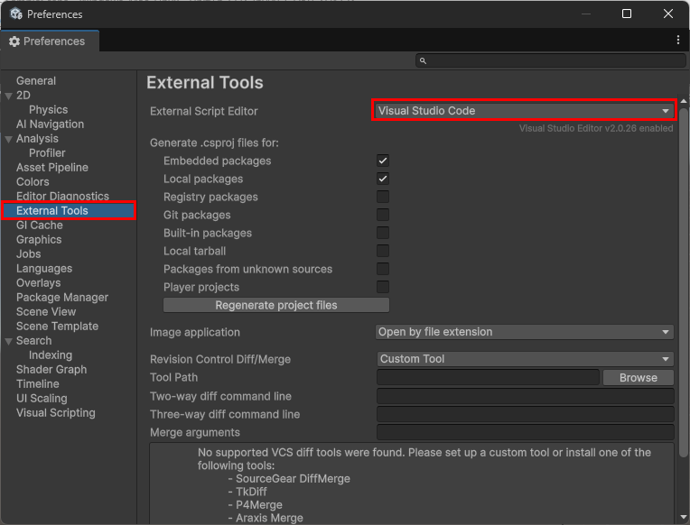

#### 배경 깔기

Scene 창에서 2D 로 볼 수 있게 '2D' 버튼을 활성화 한다.

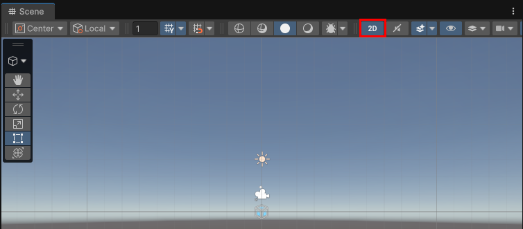

Hierarchy 창에서 마우스 우클릭을 한 뒤,

`3D Object → Quad` 를 눌러서 `Quad` 를 1개 추가한다.

여기서 `Quad` 는 배경으로 쓰인다.

`Quad` 를 `Background` 로 이름을 바꾼다.

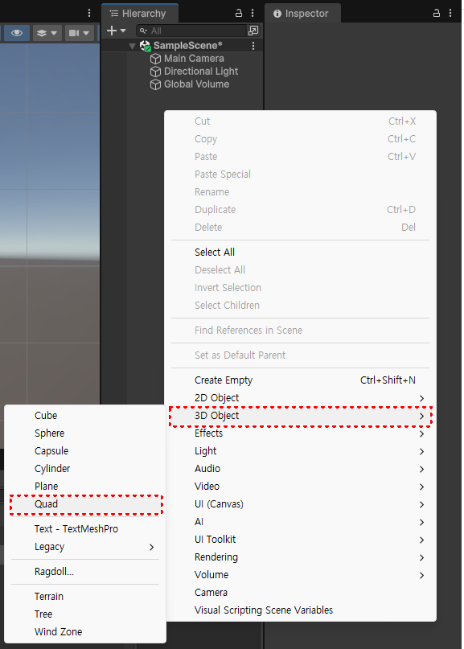

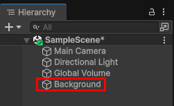

Project 창에서 마우스 우클릭한 뒤,

`Create → Material` 를 눌러서 `Material` 1개를 추가한다.

이것의 이름을 'BlackMaterial' 으로 바꾼다.

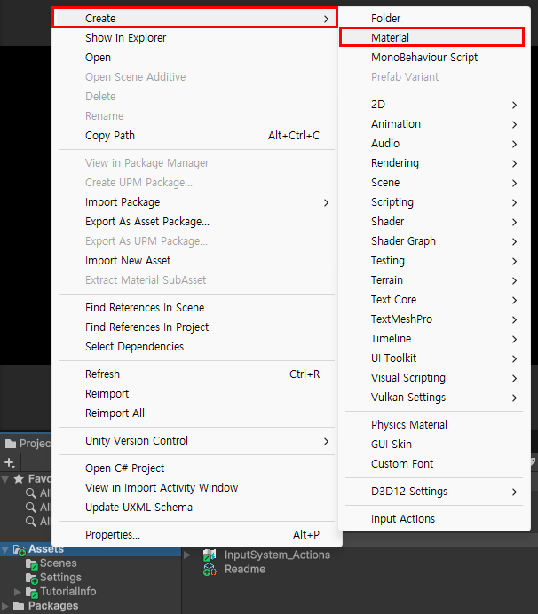

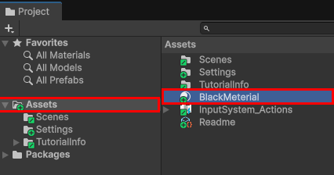

Inspector 창에서 Shader 를 `Universal Render Pipeline/Lit` 으로 선택한 뒤에, 

`Base Map` 과 `Specular Map` 을 검정색으로 선택한다.

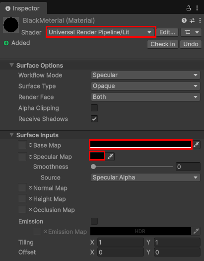

마지막으로 `BlackMaterial` 을 Hierarchy 창에의 `Background` Object 에 마우스로 끌어다 놓는다.(드래그 앤 드롭)

### 이미지를 Sprite에 추가하기

Project 창에서 `Assets` 을 선택하고 마우스 우클릭 한뒤에,

`Sprites` 폴더를 만든다.

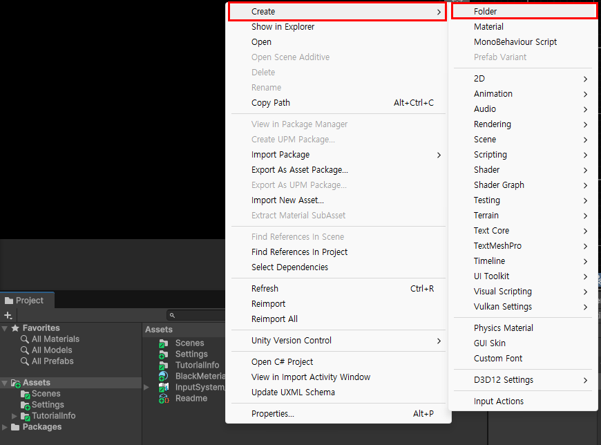

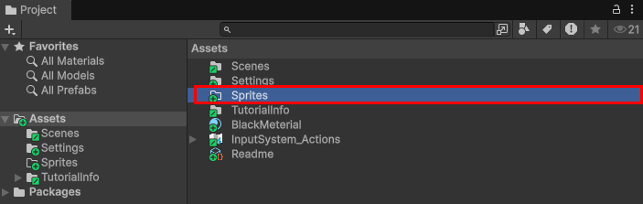

`Sprites` 폴더에 `Flights.png` 파일을 끌어다 놓는다.

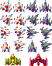

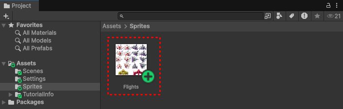

