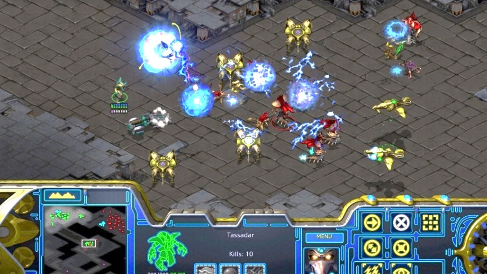
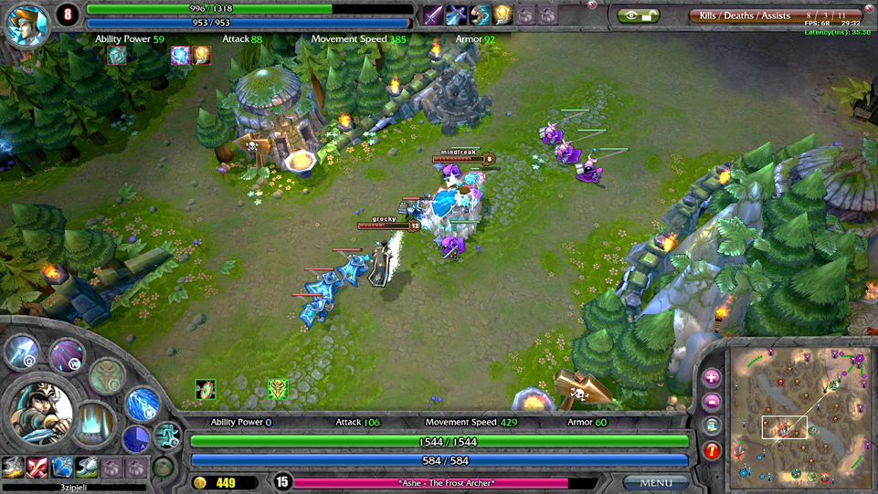
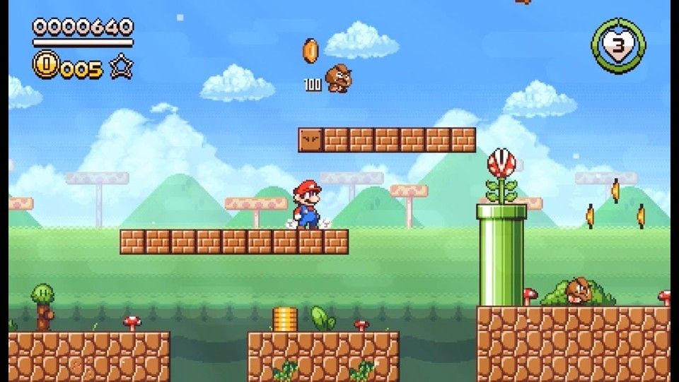

## 객체지향 프로그래밍

1. 객체지향 프로그래밍(OOP, Object-Oriented Programming)
2. 클래스를 설계할 때 쓰는 키워드

```csharp
public  class  Pet {

}
```

3. 인스턴스를 생성할 때 쓰는 키워드

```csharp
Pet  mypet  =  new  Pet();
```

## 게임에서 사용하는 객체지향(OOP)

> 현실 세계의 물건(객체)처럼 '데이터'와 '기능'을 하나의 단위로 묶어서 코딩하는 방식이다.
> 게임 속 플레이어, 몬스터, 캐릭터, 챔피언, 아이템, 불릿, ... 등 각각 하나의 클래스(설계도)로 만들고 이를 통해 게임 창에 실제로 배치하는 인스턴스(객체)를 생성해서 게임 화면에서 조작한다.





## 객체지향의 속성



* 멤버 변수: 클래스 내부에서 객체의 상태나 정보(데이터)를 저장하는 변수

> 640 과 같은 점수, 5 와 같은 코인 획득 개수, 3 과 같은 남은 생명(hp) 개수

* 멤버 함수: 클래스 내부에서 객체 할 수 있는 동작이나 기능을 정의하는 함수

> move() 와 같이 움직이는 동작을 수행하거나, jump() 와 같이 캐릭터가 점프하는 기능을 구현하거나, attack() 과 같이 공격하는 기능을 구현하는 함수


