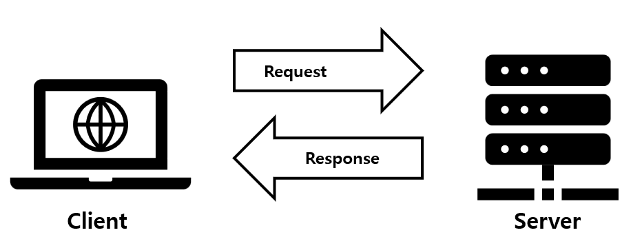

## JSP 란 무엇인가?

JSP = Java Server Page

**HTML vs. JSP**

* HTML: 정적인 웹 페이지 
* JSP: 동적인 웹 페이지 (정보를 주고 받고 할 수 있다.)

**서버와 클라이언트**

* 서버: 데이터를 제공하는 컴퓨터 (JSP)
* 클라이언트: 데이터를 제공 받는 컴퓨터 (HTML)

## 자료 주고 받기

* request: 클라이언트가 서버에게 자료를 요청
* response: 서버가 클라이언트에게 자료를 제공

## 서버로 자료를 보내는 방법

* GET 방식: 
* POST 방식: 

