<!--

-->

## 0.핵심 요약

깃허브 저장소에 유니티 프로젝트를 업로드 할 수 있습니다.

단, 작업 순서가 중요합니다. 먼저 유니티 프로젝트를 생성한 뒤에 깃허브 저장소에 업로드 해야 합니다.

**깃허브에 유니티 프로젝트 업로드 하는 방법 요약**
* 우선 [Github Desktop](https://drive.google.com/file/d/1kzihf7whcu_lpCvGRcPLduqHY6eKjoed/view?usp=sharing) 을 설치합니다.
* Unity 프로젝트를 생성합니다. `unity-project-1` 이름의 프로젝트를 예를 들어 설명합니다.
* 그 다음, Github Desktop 을 실행시켜서 Unity 프로젝트 폴더를 새로 등록합니다.
* 등록이 완료 됐으면 Github 에 업로드(Publish, Push)합니다.

## 1.Github Desktop 설치

Github 홈페이지(`https://desktop.github.com/download/`)에서 GitHub Desktop(`GitHubDesktopSetup-x64.exe`)을 다운로드 받습니다.

다운로드 속도가 느리면 이곳([https://drive.google.com/file/d/1kzihf7whcu_lpCvGRcPLduqHY6eKjoed/view?usp=sharing](https://drive.google.com/file/d/1kzihf7whcu_lpCvGRcPLduqHY6eKjoed/view?usp=sharing))에서 다운로드 받으세요.

Github Desktop 설치 후 다음과 같은 방법으로 나의 계정에 로그인을 완료합니다.

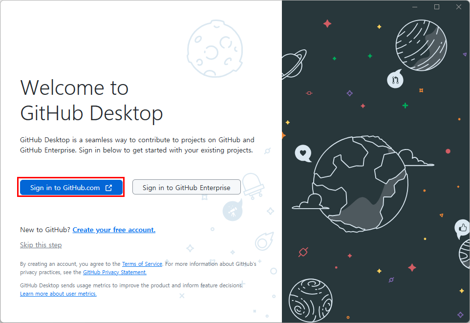

웹 브라우저에서 나의 Github 계정에 연결하여 권한을 부여합니다.

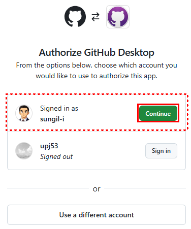

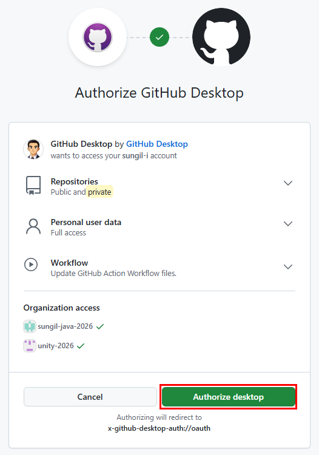

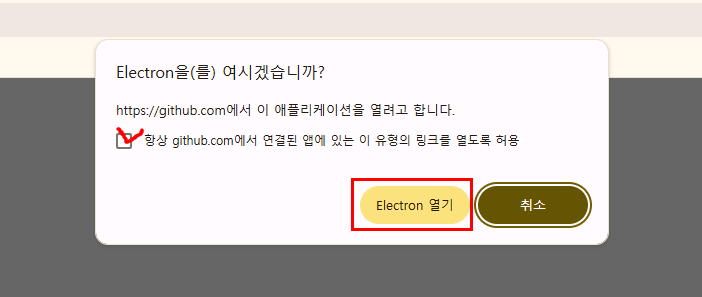

다음과 같이 Git 설정을 완료합니다.

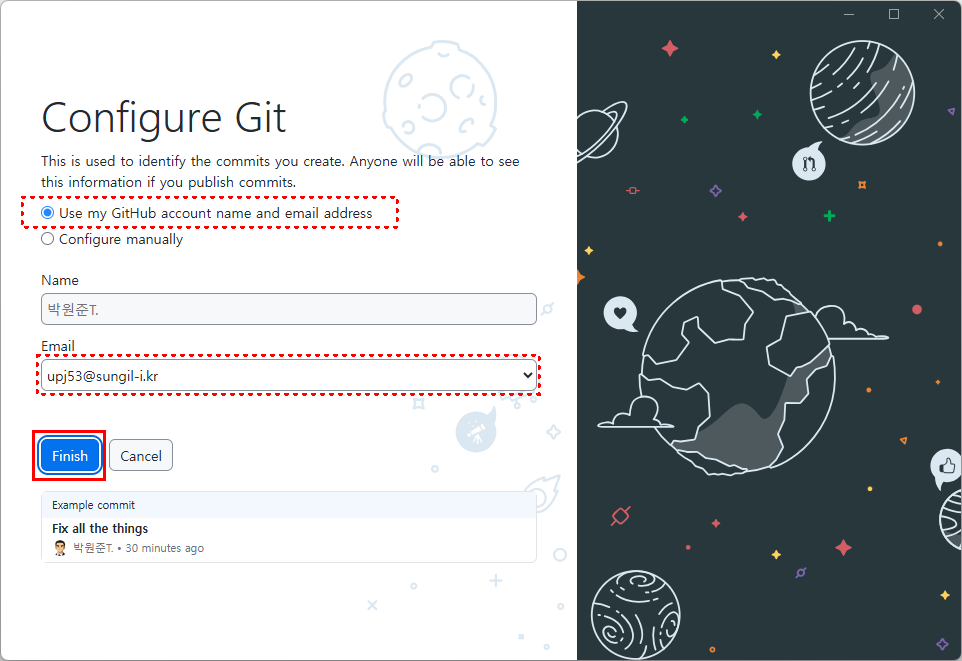

## 2.Unity 프로젝트 생성

`unity-project-1` 이름의 유니티 프로젝트를 생성합니다. 

`D:\git` 폴더가 위치에 프로젝트를 만들면 `D:\git\unity-project-1` 폴더가 만들어지면서 프로젝트가 생성됩니다.

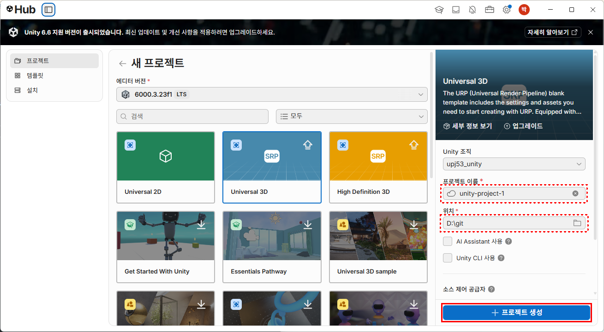

## 3.Github Desktop 에 저장소 생성 후 업로드

Github Desktop 에서 유니티에서 만든 폴더(`D:\git\unity-project-1`)를 새로운 저장소로 등록('Create a New Repository on your local drive...')합니다.

중요!

먼저 Unity 프로젝트를 생성 후, 이 폴더를 Github Desktop 의 새로운 저장소로 등록해야 합니다.

Github Desktop 의 메뉴 이름은 'Create a New Repository on your local drive...' 입니다. (다음 그림을 참고하세요.)

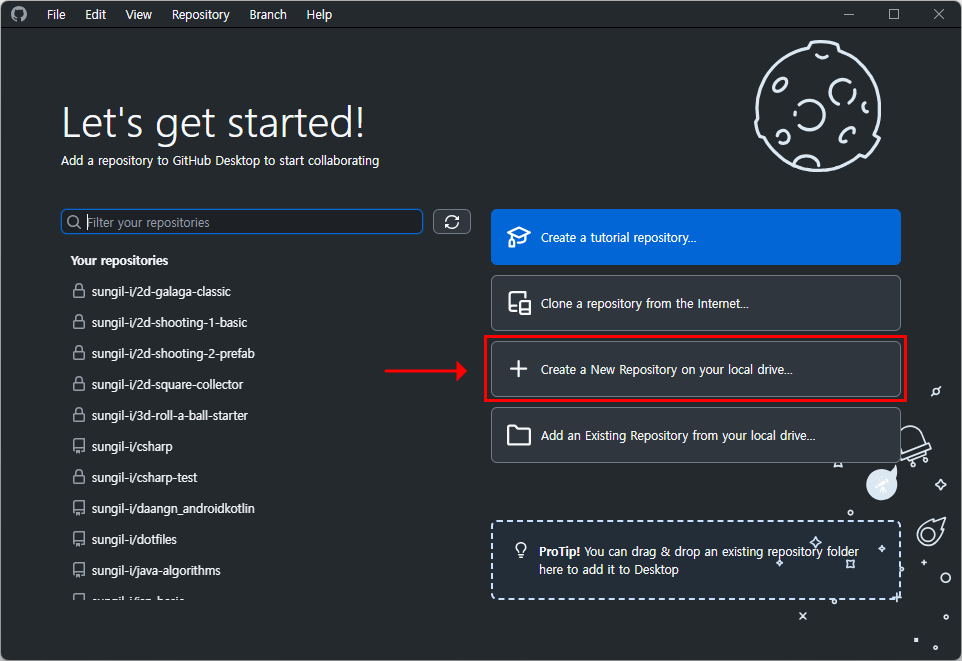

'Initialize this repository with a README' 를 체크하면 `README.md` 파일을 만들 수 있습니다.

Github Desktop 에 새로운 저장소로 등록할 때, 'Git ignore' 를 `Unity` 로 선택합니다.

'Create repository' 버튼을 누르면 Unity 프로젝트를 위한 새로운 저장소가 생성됩니다.

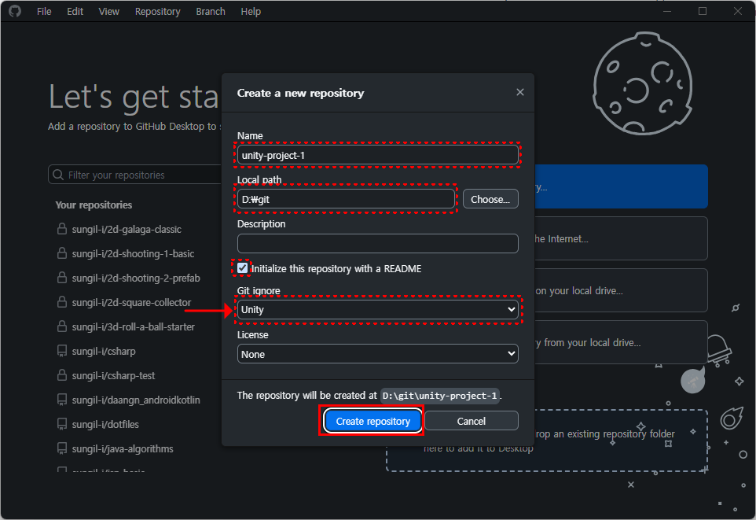

새로운 저장소가 생성된 뒤에, 'Publish repository' 버튼을 눌러서 Github 에 업로드 합니다.

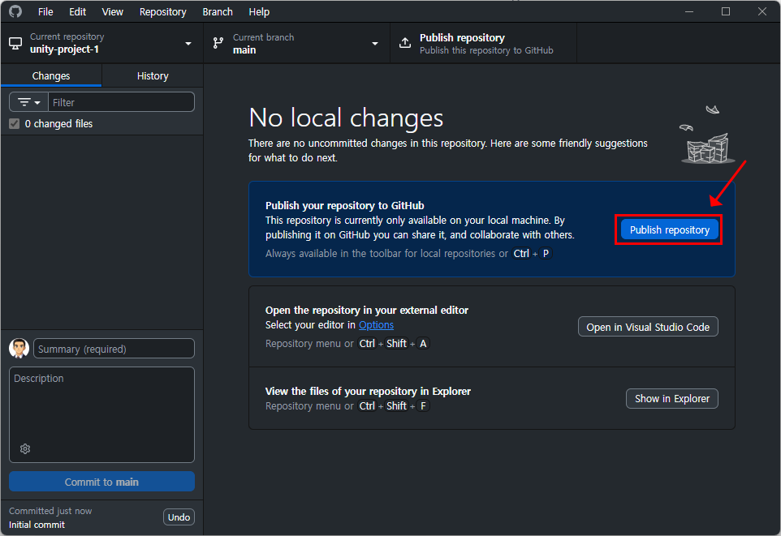

'Name' 은 Unity 프로젝트 이름(`unity-project-1`)과 동일하게 만듭니다.

'Keep this code private' 를 체크하면 Github 홈페이지에 비공개로 만들 수 있습니다.

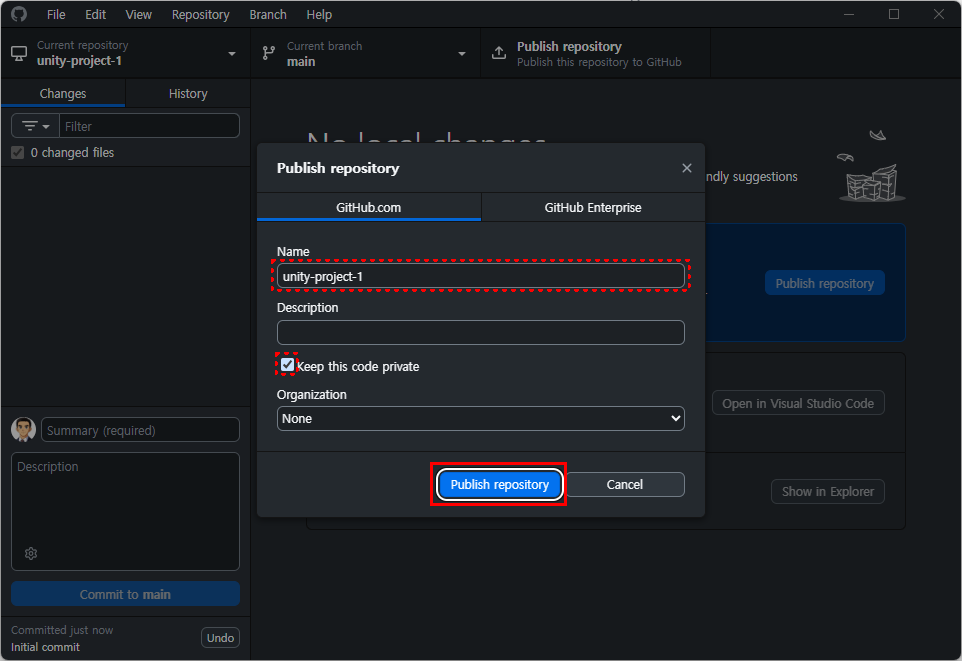

'Keep this code private' 를 체크를 해제하면 Github 홈페이지에 공개로 만들 수 있습니다.

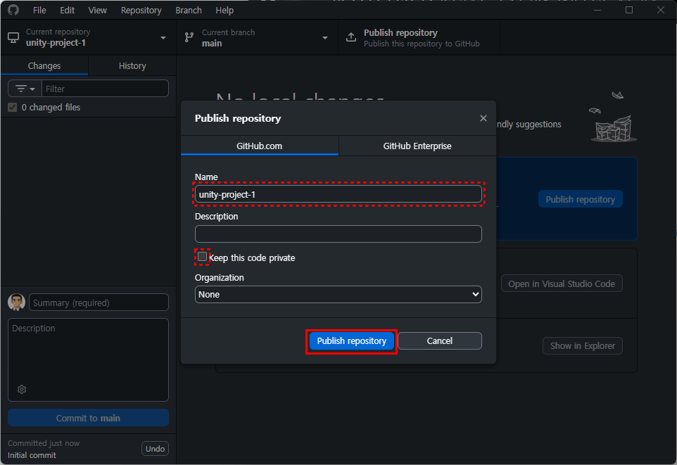

Github 에 업로드가 완료되면 다음과 같이 화면이 나온다.

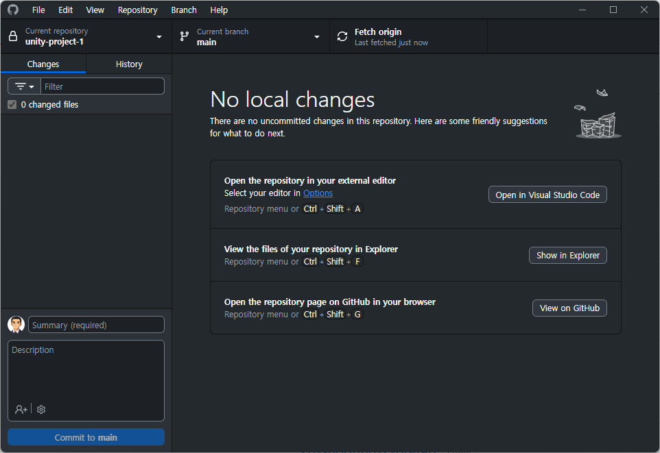

## 4.Github 웹 페이지에서 업로드 확인하기

나의 Github 홈페이지의 나의 계정에 가면 저장소(`https://github.com/아이디`)에 방금 만든 `unity-project-1` 프로젝트가 업로드 된 것을 확인할 수 있다.

나의 계정의 저장소('Repositories') 메뉴를 클릭하면 업로드한 Unity 프로젝트를 볼 수 있다.

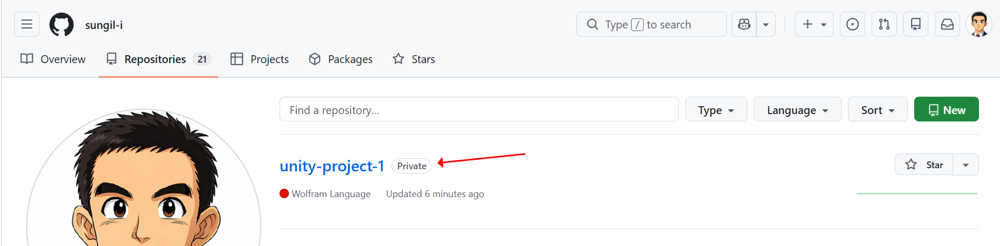

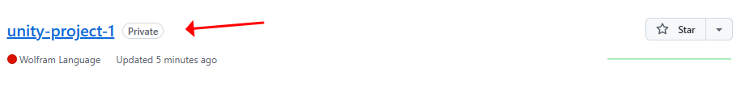

나의 Github 계정의 저장소('Repositories')에 업로드된 Unity 프로젝트(`unity-project-1`)는 다음과 같은 모습을 가진다.

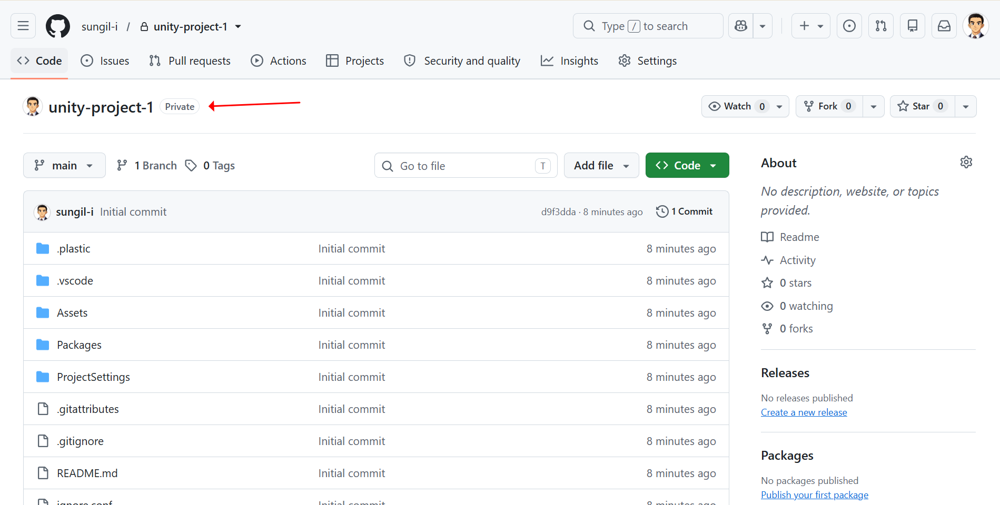

